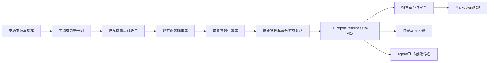

# ETF 穿透式报告一致性修复与 ETF 专项优化方案

> 状态：核心修复已实施并完成 API、自动化测试与构建验收  
> 编制日期：2026-07-23  
> 适用范围：ETF 深度研究、穿透式报告、报告目录、Agent 会话、飞书通知与前端报告展示  
> 首个验收样本：159516（半导体设备 ETF / Semi Equipment）最新报告

## 1. 结论先行

本次问题不是单个提示词或单个数据源失败，而是“事实采集、模块状态、报告审查、穿透完成度、用户可见命名”五套判断逻辑彼此独立，导致同一份报告同时出现以下互相冲突的结论：

- 产品画像覆盖率只有 0.25、字段显示“暂缺”，但 `index_and_product` 模块仍显示通过。
- 成分股研究覆盖率为 0，报告、PDF、会话与飞书仍称为“穿透式深度研究”。
- 同一个基金份额指标既被判断为“发生变化”，又被判断为“本期未覆盖”。
- 基金份额、价格、估算规模等派生数据写入事实库后丢失公式与输入事实关系，无法复算和审查。
- ETF 报告沿用了股票研究的覆盖域，缺少申赎、跟踪质量、指数方法论等 ETF 专属审查维度。

修复方向不是继续增加局部补丁，而是建立一个唯一的 ETF 报告就绪度判定器，并明确区分：

1. **证据质量**：已有事实是否可靠、是否存在缺口。
2. **结构就绪度**：ETF 身份、指数、持仓、产品指标是否足以形成结构型报告。
3. **穿透就绪度**：成分股研究是否达到可以正式称为“穿透式”的覆盖门槛。
4. **发布状态**：报告能否发布，以及应使用什么标题、文件名和完成提示。

建议新增 `ETFReportReadiness` 作为唯一判定结果，后端报告、目录、Agent、飞书和前端只消费该结果，不再各自推导状态。

---

## 2. 可观察量、可控制量与必须保证的性质

### 2.1 可观察量

- ETF 官方身份、指数代码、指数方法论版本、费用、申赎与上市信息。
- 持仓披露日期、持仓权重覆盖率、成分股数量与权重集中度。
- 基金份额、最新价格、NAV、估算规模、成交额、折溢价与跟踪指标。
- 被选成分股数量、已完成研究数量、复用研究数量、按权重计算的研究覆盖率。
- 每项事实的来源、抓取时间、有效期、公式、输入事实和冲突状态。
- 各阶段生成的快照、事实记录、模块状态、报告审查结果与用户可见状态。

### 2.2 可控制量

- 字段刷新策略与来源优先级。
- 事实模型和派生计算链路。
- 历史指标比较键与变化阈值。
- 结构报告和穿透报告的硬门槛。
- 报告标题、PDF 文件名、完成事件和飞书文案的映射。
- 旧数据兼容、重建索引与灰度开关。

### 2.3 必须保证的性质

实施后必须满足以下不变量：

1. 同一字段不能在同一报告中既“有值”又“缺失”。
2. 产品画像存在硬性缺失时，相关报告章节不能显示 `passed`。
3. 成分股研究覆盖率为 0 时，任何出口都不能把报告称为“穿透式深度研究”。
4. 滚动指标跨日期更新时，不能同时产生“新增”和“旧值缺失”的矛盾。
5. 派生事实必须能通过 `formula + input_fact_ids + calculation_version` 复算。
6. 同一份报告在 manifest、目录、Agent、飞书和前端展示的就绪状态必须一致。
7. 模型可以解释缺口，但不能自行放宽代码定义的审查门槛。
8. 旧报告保持可读，不重写历史正文和 PDF；新逻辑只增加结构化判定和兼容投影。

---

## 3. 当前冲突与根因清单

| 编号 | 当前现象 | 根因 | 主要代码位置 | 风险 |
|---|---|---|---|---|
| C1 | `product_profile=warning`，但 `index_and_product=passed` | 内部流水线状态与报告章节状态混在同一命名空间；“暂缺”不是结构化缺口 | `agent/src/reports/service.py` | 报告审查结论自相矛盾 |
| C2 | 官方份额补齐后仍保留早期缺失/质量状态 | `quality_status` 和 `missing_optional_fields` 在全部数据源完成前计算，后续没有统一收口 | `agent/src/reports/etf_product_profile.py` | 最终产品画像使用过期状态 |
| C3 | 同一滚动指标既“变化”又“未覆盖” | 历史比较键包含 period，所有指标又共用 1% 阈值 | `agent/src/research/knowledge.py` | 趋势章节产生错误结论 |
| C4 | 估算规模、折溢价等无法复算 | 写入报告事实时统一丢弃公式和输入事实 ID | `agent/src/reports/etf_product_profile.py` | 无法通过正式审查和数据追溯 |
| C5 | 成分研究覆盖率为 0 仍命名“穿透式” | 文件名、标题和完成事件只看报告生成成功或 `passed_with_gaps` | `agent/src/reports/service.py`、`agent/src/session/service.py`、`agent/src/channels/feishu.py`、`frontend/src/pages/Agent.tsx` | 用户被错误告知穿透完成 |
| C6 | 状态逻辑到处重复 | snapshot、product profile、tool、contract、report、catalog、frontend 分别计算 | 多模块 | 修一个入口仍会在其他入口复发 |
| C7 | 分析模块列表包含两种不同对象 | `identity/product_profile/market_data` 等流水线检查与报告章节混在 `analysis_modules` | manifest、contract、report service | 汇总与审查含义不清 |
| C8 | P4A/P4B 状态存在多份副本 | selection、resolution、facts、index、manifest、catalog 都持久化相似状态，hydrate 再次重建 | `agent/src/reports/service.py` 等 | 状态漂移、重跑结果不可预测 |
| C9 | ETF 使用股票默认研究域 | `create_coverage_plan()` 未按 profile 选择领域 | `agent/src/research/knowledge.py` | ETF 特有风险长期缺席 |
| C10 | 提示词要求复用，工具却强制刷新 | `PrepareETFResearchTool` 固定传 `force_refresh=True` | `agent/src/tools/etf_research_context_tool.py` | 不必要刷新、同报告内时间口径变化 |
| C11 | 前端模块 ID 别名不一致 | Reports 页只映射部分旧 ID，MessageBubble 又单独维护另一套 | `frontend/src/pages/Reports.tsx` 等 | 同模块在不同页面显示不同名称 |
| C12 | 当前测试全部通过但语义仍有冲突 | 测试聚焦单模块正确性，缺少跨阶段不变量和最终出口一致性测试 | `agent/tests/`、前端测试 | 回归测试无法阻止同类问题 |

当前基线测试：

```text
agent/tests/test_etf_product_profile.py
agent/tests/test_etf_report_bridge.py
agent/tests/test_etf_deep_research.py
agent/tests/test_etf_penetration.py

结果：46 passed in 11.01s
```

这说明现有实现并非普遍不可运行，而是缺少能够捕获跨模块语义冲突的测试。

---

## 4. 目标状态模型

### 4.1 分离两个正交维度

保留现有证据质量枚举，不再用它表示穿透完成度：

```python
EvidenceQualityStatus = Literal[
    "passed",
    "passed_with_gaps",
    "failed_validation",
]
```

新增 ETF 报告就绪度：

```python
ETFReadinessStatus = Literal[
    "not_publishable",
    "structure_ready",
    "penetration_partial",
    "penetration_ready",
]
```

推荐新增文件：

```text
agent/src/reports/etf_report_readiness.py
```

推荐契约：

```python
@dataclass(frozen=True)
class ETFReportReadiness:
    version: str
    status: ETFReadinessStatus
    evidence_quality: EvidenceQualityStatus
    hard_gate_passed: bool
    structure_checks: dict[str, CheckResult]
    penetration_checks: dict[str, CheckResult]
    metrics: dict[str, float | int | str | None]
    reason_codes: tuple[str, ...]
    missing_actions: tuple[str, ...]
    evaluated_at: str
    input_fingerprint: str
```

`reason_codes` 使用稳定机器枚举，中文说明由展示层映射。示例：

```text
missing_official_index_identity
holdings_weight_coverage_below_threshold
mandatory_component_research_missing
component_research_coverage_below_threshold
derived_fact_lineage_incomplete
material_fact_conflict
```

### 4.2 默认门槛

门槛由代码配置控制，模型不得放宽。首版建议：

| 检查项 | 默认门槛 | 性质 |
|---|---:|---|
| ETF 身份与指数官方字段 | 必须通过 | 硬门槛 |
| 持仓权重覆盖率 | `>= 95%` | 结构门槛 |
| 强制研究成分股 | 权重 `>= 8%` 的成分全部完成 | 穿透硬门槛 |
| 被选择成分股研究完成率 | `>= 80%` | 穿透门槛 |
| 已研究成分股所代表 ETF 权重 | `>= 40%` | 穿透门槛 |
| 重大事实冲突 | `0` | 穿透硬门槛 |
| 派生事实关键链路 | `100%` 可复算 | 正式审查门槛 |

门槛应放入可版本化配置，例如 `etf-readiness-v1`，并将版本写入 manifest，避免未来调整门槛后旧报告被无声改判。

### 4.3 状态判定

```python
if evidence_quality == "failed_validation" or not hard_gate_passed:
    status = "not_publishable"
elif all(penetration_checks_passed):
    status = "penetration_ready"
elif component_research_completed_count > 0:
    status = "penetration_partial"
else:
    status = "structure_ready"
```

正式实现还需满足：

- `structure_ready` 不代表没有证据缺口，只代表结构报告的硬门槛已通过。
- `penetration_partial` 必须展示实际研究覆盖率和未完成成分。
- `penetration_ready` 允许存在非关键辅助证据缺口，因此可与 `passed_with_gaps` 共存。
- `not_publishable` 可以生成诊断草稿，但不得产生“正式通过”完成事件。

### 4.4 用户可见命名映射

| 就绪状态 | 页面标题 | PDF 文件名类型 | Agent/飞书完成提示 |
|---|---|---|---|
| `not_publishable` | ETF 研究诊断草稿 | `ETF研究诊断草稿` | 生成未通过审查，列出阻断项 |
| `structure_ready` | ETF 结构研究 | `ETF结构研究` | 结构报告已生成，尚未完成成分穿透 |
| `penetration_partial` | ETF 穿透研究（部分覆盖） | `ETF穿透研究-部分覆盖` | 已完成部分穿透，明确覆盖率 |
| `penetration_ready` | ETF 穿透式深度研究 | `ETF穿透式深度研究` | 穿透式深度研究已完成 |

所有出口必须调用同一个投影函数，禁止硬编码“穿透式”：

```python
project_etf_report_presentation(readiness, symbol, name, date)
```

---

## 5. 目标数据流与唯一事实来源



### 5.1 持久化职责

| 数据 | 唯一事实来源 | 其他位置的处理方式 |
|---|---|---|
| 原始采集与字段状态 | product profile snapshot | 只引用 snapshot ID |
| 持仓穿透选择 | `holding_penetration_selection.json` | 不复制选择明细 |
| 成分研究解析 | `component_digest_resolution.json` | 不复制解析明细 |
| 研究事实与派生事实 | `facts.jsonl` | manifest 只存统计和引用 |
| 就绪度 | manifest 顶层 `etf_readiness` | catalog/API/frontend 只做投影 |
| 报告章节状态 | manifest `report_sections` | 不混入流水线检查 |
| 流水线执行状态 | manifest `pipeline_checks` | 不作为章节审查结果 |

### 5.2 manifest 结构调整

建议新增结构，保留旧 `analysis_modules` 作为一个发布周期的兼容投影：

```json
{
  "schema_version": 3,
  "pipeline_checks": {
    "identity": {},
    "product_profile": {},
    "holdings": {},
    "market_data": {},
    "component_research": {}
  },
  "report_sections": {
    "index_and_product": {},
    "holdings_and_exposure": {},
    "valuation_and_fundamentals": {},
    "flow_liquidity_tracking": {},
    "component_penetration": {}
  },
  "etf_readiness": {
    "version": "etf-readiness-v1",
    "status": "structure_ready",
    "reason_codes": ["component_research_coverage_below_threshold"]
  }
}
```

`_hydrate_etf_module_contract` 只保留为旧 manifest 迁移路径；schema v3 新报告不得在正常运行中反向重建并覆盖规范化状态。

---

## 6. 关键修复设计

### 6.1 产品画像统一收口

在所有数据源调用完成之后只执行一次：

```python
finalize_product_profile(raw_state, source_results, refresh_policy)
```

该函数负责：

1. 按字段应用来源优先级和时间有效性。
2. 解析来源冲突并保留冲突记录。
3. 计算所有派生指标。
4. 重新计算 `missing_required_fields`、`missing_optional_fields`、coverage 和 quality。
5. 生成唯一 final snapshot；中间状态仅用于 trace，不进入报告事实。
6. 产生供 readiness evaluator 使用的结构化检查结果。

推荐来源原则：

- 官方交易所、基金公司或指数公司优先于聚合数据商。
- 对基金份额、NAV、持仓等时间敏感字段，先比较 `as_of`，再比较来源等级。
- 若官方值过旧而非官方值较新，不静默替换；保留两者并形成 `stale_official_value` 或 `source_conflict`。
- `fund_units × price` 得到的是“估算规模”，不能标注为“交易所披露规模”。

### 6.2 字段级刷新策略

移除工具层无条件 `force_refresh=True`，改为显式刷新计划：

| 字段组 | 默认策略 | 触发刷新 |
|---|---|---|
| ETF 身份、跟踪指数 | 版本驱动 | 版本变更、缺失、人工强制 |
| 指数方法论 | 版本驱动 | 新方法论版本或校验失败 |
| 费率、招募说明书 | 版本驱动 | 公告更新或有效期到期 |
| 基金份额、价格、NAV | 日内/交易日驱动 | 超过 TTL、报告口径要求、人工强制 |
| 持仓 | 披露日期/调仓驱动 | 新披露期、权重覆盖不足 |
| 成分股研究 | 研究新鲜度驱动 | 过期、重大事件、用户要求 |

每次报告生成先固定 `report_as_of` 和 `refresh_plan_id`。同一份报告内不得因多次调用工具而改变时间口径。

### 6.3 派生事实血缘

事实契约至少增加：

```json
{
  "metric": "estimated_fund_market_value",
  "value": 123456789.0,
  "unit": "CNY",
  "formula": "fund_units * latest_price",
  "input_fact_ids": ["fact:fund_units:...", "fact:latest_price:..."],
  "calculation_version": "etf-product-calc-v1",
  "source_kind": "derived",
  "as_of": "2026-07-23"
}
```

写入前增加复算校验：

- 输入事实存在且单位兼容。
- 复算值与存储值误差在该指标容差内。
- 计算结果的 `as_of` 不晚于任何输入事实的可用时间。
- 输入事实变化时派生事实 ID 或 fingerprint 必须变化。

### 6.4 历史变化比较策略注册表

替代统一 comparison key 和统一 1% 阈值：

```python
METRIC_COMPARISON_POLICIES = {
    "fund_name": IdentityPolicy(ignore_period=True, exact=True),
    "expense_ratio": VersionedPolicy(version_or_effective_date=True),
    "fund_units": RollingSnapshotPolicy(relative_tolerance=0.001),
    "latest_price": RollingSnapshotPolicy(relative_tolerance=0.005),
    "nav": RollingSnapshotPolicy(relative_tolerance=0.001),
    "holdings_weight_coverage": RollingSnapshotPolicy(absolute_tolerance=0.01),
    "revenue": FinancialPeriodPolicy(period_in_identity=True),
}
```

比较规则分为四类：

1. **身份/版本事实**：忽略普通 period，按精确值或正式版本比较。
2. **财务期间事实**：period 属于事实身份，不同期间并列存在。
3. **滚动快照指标**：报告差异只比较前后最新值；period 作为元数据。
4. **历史序列**：事实库保留完整序列，但报告变化摘要使用“最新值投影”。

必须增加互斥规则：同一 `metric + scope` 在同一次 diff 中不能同时出现在 `updated` 与 `stale/missing`。

### 6.5 ETF 专属覆盖域

`create_coverage_plan(profile="etf")` 应使用 ETF 域注册表：

```text
fund_identity
index_methodology
holdings_universe
portfolio_fundamentals
market_microstructure
creation_redemption
tracking_quality
peer_comparison
component_research
scenario_monitoring
```

其中以下域属于正式穿透审查的必要输入：

- `holdings_universe`
- `portfolio_fundamentals`
- `component_research`
- `tracking_quality`

股票默认域继续服务股票报告，不能通过全局替换影响现有股票研究。

---

## 7. 分阶段实施计划

### Phase 0：锁定现状与失败样本

目标：先把当前矛盾转成可重复失败的测试，避免修复过程中移动目标。

修改范围：

- `agent/tests/fixtures/`：固定 159516 的最小脱敏输入与 manifest 片段。
- 新增 `agent/tests/test_etf_report_invariants.py`。
- 必要时新增前端 fixture，不复制完整真实报告正文。

任务：

1. 固定“产品字段暂缺但章节通过”的失败用例。
2. 固定“研究覆盖为 0 但标题为穿透式”的失败用例。
3. 固定“fund_units 同时 updated 和 stale”的失败用例。
4. 固定“派生事实无血缘”的失败用例。
5. 记录旧逻辑输出，作为新旧 shadow 比较基线。

退出标准：四类测试在旧实现上稳定失败，且不会依赖实时网络。

### Phase 1：建立唯一就绪度契约

目标：先统一判定语义，再修改各出口。

主要文件：

- 新增 `agent/src/reports/etf_report_readiness.py`
- `agent/src/reports/contracts.py`
- `agent/src/reports/service.py`
- 对应单元测试

任务：

1. 实现稳定 reason code、阈值配置和 input fingerprint。
2. 将 `pipeline_checks`、`report_sections`、`etf_readiness` 分离。
3. 在报告最终化阶段只计算一次 readiness。
4. 为旧 manifest 提供只读兼容投影。
5. 保留 `quality_status`，但禁止用它直接推断穿透完成。

退出标准：相同输入在任意入口得到完全相同的 readiness JSON；重复计算结果幂等。

### Phase 2：修正产品画像收口与事实血缘

目标：确保产品字段、质量状态和派生事实来自同一个最终状态。

主要文件：

- `agent/src/reports/etf_product_profile.py`
- ETF profile/provider 相关测试

任务：

1. 将早期 quality 计算移动至所有数据源处理完成之后。
2. 收敛为一个 final snapshot，其他阶段只写 trace。
3. 明确官方值、较新非官方值和估算值的优先级及标签。
4. 为折溢价、估算规模等写入公式和输入事实 ID。
5. 在 report records 生成时保留完整 lineage。
6. 把“暂缺”改为结构化 gap 的展示结果，而不是正文关键字。

退出标准：官方份额后补时 missing/coverage/quality 会同步重算；所有关键派生指标均可复算。

### Phase 3：重构历史差异比较

目标：消除滚动指标的“新增 + 旧值缺失”矛盾。

主要文件：

- `agent/src/research/knowledge.py`
- 新增或扩展 comparison policy 测试

任务：

1. 建立指标比较策略注册表。
2. 区分 identity、versioned、financial period、rolling snapshot、series。
3. 为未知指标设置保守默认策略并记录 warning。
4. 增加 diff 结果互斥校验。
5. 报告摘要只消费规范化 diff，不再次按文本推断。

退出标准：跨日 fund_units 只出现 updated；真正缺失的指标只出现 missing/stale；财务期间序列不被错误覆盖。

### Phase 4：规范 P4A/P4B 与模块状态

目标：减少状态副本，停止 hydration 在正常新流程中反向改写状态。

主要文件：

- `agent/src/reports/service.py`
- `agent/src/reports/reader.py`
- ETF penetration 相关模块与测试

任务：

1. selection、resolution、facts 作为规范数据。
2. manifest 仅保存引用、统计与 readiness。
3. catalog 只保存可重建的展示投影。
4. schema v3 跳过 legacy hydration 写回。
5. 为旧 schema 保留迁移读取，不修改旧原始文件。

退出标准：删除任一可重建投影后重新索引，得到相同结果；规范文件 fingerprint 未变化。

### Phase 5：统一所有用户出口

目标：页面、PDF、会话和飞书完全遵循 readiness 命名。

主要文件：

- `agent/src/reports/service.py`
- `agent/src/reports/catalog.py`
- `agent/src/session/service.py`
- `agent/src/channels/feishu.py`
- `frontend/src/pages/Agent.tsx`
- `frontend/src/pages/Reports.tsx`
- MessageBubble/共享类型与常量

任务：

1. 后端返回 `readiness.status`、reason codes、覆盖指标和统一展示文案。
2. PDF 标题和文件名通过同一投影函数生成。
3. Agent 完成事件区分结构报告、部分穿透、完整穿透和未通过审查。
4. 飞书卡片展示“已研究权重 / 已选成分完成率 / 主要阻断项”。
5. 前端不再从 `quality_status` 或模块数量自行猜测完成度。
6. 合并模块 ID 映射，后端规范 ID 为准；旧别名保留一个发布周期。

退出标准：同一 report ID 在五个出口显示相同状态和标题；覆盖率为 0 时不存在“穿透式已完成”文案。

### Phase 6：灰度迁移与目录重建

目标：不破坏旧报告的前提下上线新判定。

任务：

1. 增加 `ETF_REPORT_READINESS_V2_ENABLED` 开关。
2. 第一阶段 shadow compute：记录新旧结果差异，不改变用户出口。
3. 对历史 manifest 只计算 readiness 投影，不重写 Markdown/PDF。
4. 重建 report catalog 中 ETF 状态和展示元数据。
5. 观察差异后切换 API，再切换前端/Agent/飞书，最后移除旧推断。

退出标准：历史报告可正常打开；新老目录数量一致；切换开关可恢复旧展示逻辑而不影响事实数据。

### Phase 7：真实样本验收

至少选择三类 ETF：

1. 159516：当前半导体设备 ETF，成分研究覆盖为 0 的问题样本。
2. 一只持仓与成分研究完整的 ETF，用于验证 `penetration_ready`。
3. 一只身份/指数官方字段缺失的 ETF，用于验证 `not_publishable`。

验收必须使用固定报告时间口径，先运行离线 fixture，再进行一次允许联网的实时刷新验证。

---

## 8. 测试矩阵

### 8.1 单元测试

| 测试 | 断言 |
|---|---|
| 产品字段后补 | 官方份额写入后重新计算 missing/coverage/quality |
| 来源冲突 | 保留冲突，按优先级选值，不伪装成官方披露 |
| 派生事实 | 公式、输入 ID、计算版本完整且可复算 |
| 滚动指标比较 | 新日期值为 updated，不产生 added + stale |
| 财务期间比较 | 不同财务期间并列，不当作旧值缺失 |
| readiness 幂等 | 同一 fingerprint 多次判定结果一致 |
| 标题映射 | 四种 readiness 只映射到各自允许的标题 |

### 8.2 跨阶段不变量测试

必须新增以下断言：

```text
若 product_profile.required_gap_count > 0，相关 report section 不得为 passed。
若某 fact 已进入最终事实集，同一 scope/period 不得再产生 missing gap。
若 component_research_weight_coverage == 0，readiness 不得为 penetration_ready。
若 readiness != penetration_ready，标题和文件名不得包含“穿透式深度研究”。
若 derived fact 无 formula 或 input_fact_ids，正式审查不得通过。
同一 metric + scope 的 diff 分类必须互斥。
```

### 8.3 API 与前端测试

- API schema 对旧客户端保留 `analysis_modules`，新客户端读取 `etf_readiness`。
- Reports 页、Agent 消息、报告详情对同一 fixture 渲染相同状态。
- 旧模块 ID 仍可显示，但日志提示 alias 已弃用。
- PDF 下载文件名与页面标题一致。
- 飞书 payload 快照测试不进行真实外发。

### 8.4 回归测试

- 现有 46 个 ETF 测试全部通过。
- 股票深度研究测试不得因 ETF profile registry 改动而变化。
- 报告目录、Markdown/PDF 预览和显式下载行为保持不变。
- 旧报告 schema v1/v2 可读取、可预览、可下载。

---

## 9. 159516 首个验收标准

在尚未补充任何成分股研究的情况下，新逻辑应给出：

```text
evidence_quality: 根据真实证据结果为 passed 或 passed_with_gaps
readiness.status: structure_ready
component_research_coverage: 0
页面标题: ETF 结构研究
PDF 类型: ETF结构研究
完成提示: 结构报告已生成，尚未完成成分穿透
```

同时必须满足：

- 产品画像字段缺失与 `index_and_product` 章节结论一致。
- 基金份额使用官方值、明确的较新替代值，或明确标为估算，不混淆来源。
- 估算规模可以从份额和价格复算。
- 历史变化章节不再同时说基金份额“已变化”和“未覆盖”。
- 页面清楚列出距离 `penetration_ready` 尚缺哪些成分研究、多少研究权重。

完成成分研究后：

- 任一强制成分缺失，保持 `penetration_partial`。
- 强制成分全部完成但总体覆盖门槛不足，保持 `penetration_partial`。
- 全部门槛通过且无重大冲突，才升级为 `penetration_ready` 并使用“穿透式深度研究”。

---

## 10. 可观测性与审计

每次就绪度计算记录一条结构化日志：

```json
{
  "event": "etf_report_readiness_evaluated",
  "report_id": "...",
  "readiness_version": "etf-readiness-v1",
  "input_fingerprint": "...",
  "old_status": "...",
  "new_status": "structure_ready",
  "reason_codes": ["component_research_coverage_below_threshold"],
  "metrics": {
    "holdings_weight_coverage": 0.98,
    "component_research_completion": 0.0,
    "researched_etf_weight": 0.0
  }
}
```

建议监控：

- 新旧状态不一致报告数。
- `penetration_ready` 中存在重大 gap 的报告数，目标为 0。
- 同一报告多出口标题不一致数，目标为 0。
- 派生事实不可复算数，目标为 0。
- 未知 metric comparison policy 数量。
- 同一刷新周期内重复 final snapshot 数量，目标为 0。

---

## 11. 回滚与兼容边界

### 11.1 可回滚内容

- 通过 feature flag 恢复旧的展示判定。
- catalog readiness 投影可重新生成。
- 前端可暂时回退到兼容字段。

### 11.2 不应回滚的正确性修复

- 派生事实血缘不应删除。
- 来源标签不能回退为误导性的“官方披露”。
- 新生成报告的最终 snapshot 不应恢复为多份互相竞争的副本。

### 11.3 历史数据策略

- 不重写旧 Markdown 和 PDF，不修改其原始生成时间。
- 可以为旧报告补充“按新规则回看”的 readiness 投影，但必须标明计算版本和重算时间。
- 无法从旧数据可靠重建的字段标为 `unknown`，不得猜测。

---

## 12. 实施顺序与改动控制

建议按以下顺序提交，每一步都可独立审查：

1. 失败 fixture 与不变量测试。
2. readiness 契约与 shadow evaluator。
3. 产品画像 finalization 与事实血缘。
4. 历史比较策略注册表。
5. manifest schema v3 与 P4 状态规范化。
6. 后端用户出口投影。
7. 前端、Agent 与飞书统一展示。
8. 目录重建、真实样本验收和旧逻辑移除。

不建议在同一个提交中进行通用工具函数大重构。`_canonical_json`、`_parse_time`、`_stable_id`、quality map 等静态重复可以在核心语义稳定后逐步收敛，避免扩大本轮风险面。

---

## 13. 完成定义（Definition of Done）

只有同时满足以下条件，本轮修复才算完成：

- [ ] 159516 不再被错误命名为完整穿透式报告。
- [ ] 证据质量与穿透就绪度成为两个独立字段。
- [ ] pipeline checks、report sections、penetration readiness 不再共用一个状态字典。
- [ ] 产品画像在所有来源完成后只做一次最终质量收口。
- [ ] 关键派生事实均有公式、输入事实和计算版本。
- [ ] 滚动指标比较不再产生“新增 + 旧值缺失”矛盾。
- [ ] ETF 使用 ETF 专属覆盖域，股票报告行为保持不变。
- [ ] 同一报告在 manifest、catalog、API、页面、PDF、Agent、飞书中的状态一致。
- [ ] 成分研究覆盖率、强制成分完成情况和已研究权重对用户可见。
- [ ] 旧报告仍可正常读取、预览和下载。
- [ ] 现有 ETF 回归测试全部通过，新增跨阶段不变量测试全部通过。
- [ ] feature flag 能安全切换，shadow 日志没有未解释的高风险差异。

---

## 14. 本轮明确不做的事项

- 不自动扩大成分股研究数量或触发高成本研究；缺口先透明呈现。
- 不把任何 `passed_with_gaps` 自动解释成“穿透完成”。
- 不修改交易执行边界，仍保持 `trade_execution=forbidden`。
- 不重写历史报告正文以制造“修复后”的假象。
- 不通过提示词要求模型掩盖数据不足；正式门槛由确定性代码控制。
- 不在本轮顺手重构所有通用 helper，避免影响非 ETF 报告。

该方案的核心验收不是“报告终于生成了”，而是报告生成后能够准确说明它完成到了哪一层、为什么未通过正式穿透审查、还缺什么，以及所有展示入口对此给出同一个答案。

---

## 15. 实施记录（2026-07-23）

已完成：

- 新增唯一的 `ETFReportReadiness` 确定性判定及四级状态。
- manifest schema 升级至 v3，增加 `pipeline_checks`、`report_sections`、`etf_readiness`，旧 `analysis_modules` 保留兼容。
- 产品画像改为全部来源结束后统一收口，并将 product metrics 收敛为单个最终快照。
- 折溢价、估算场内规模保留公式、输入事实和计算版本。
- ETF 使用独立覆盖域；产品画像改为字段新鲜度驱动，移除报告工具的无条件强制刷新。
- 历史差异比较按身份、财务期间与滚动指标分别处理；滚动指标不再因 period 变化产生 `added + stale`。
- 报告目录、会话事件、飞书、Reports 页、Agent 页和消息卡片统一消费 readiness。
- schema-v3 正常流程不再反向 hydrate 已存在的 P4A/P4B 模块；旧报告仍保留恢复路径。

验收结果：

- ETF 与知识库相关测试：`71 passed`。
- 报告 API、PDF、运行时、飞书和会话相关回归：`87 passed`；另有 2 个与本改动无关的日报“当前有效期”日期依赖测试，在 2026-07-23 对 2026-07-17/21 fixture 判定过期。
- 前端生产构建通过；Reports、MessageBubble 与新展示投影测试：`39 passed`。
- 159516 最新正式报告实时 API 投影：`quality=passed_with_gaps`、`readiness=structure_ready`、成分研究覆盖 `0%`；`product_profile=warning` 时 `index_and_product=warning`。
- 报告目录已执行 reconcile；159516 在目录中为 `coverage_status=partial`，不再被投影为完整穿透。
- 历史 Markdown/PDF 保持不可变，因此旧 artifact 内的旧标题和旧文件名不重写；新页面标题与后续新产物使用 readiness 命名。
