# AI 持仓哨兵（常态化个股监控）实施计划

状态：产品、架构、基本面文本监控与一致性审查完成；待 M0 数据源、文档源、运行时与飞书链路可行性门禁通过后进入实施<br>
页面入口：`/portfolio`<br>
首期市场：A 股与场内 ETF<br>
通知渠道：飞书<br>
系统边界：研究、观察与提醒，不创建、提交、修改或取消任何真实订单

关联文档：[`PORTFOLIO_DAILY_RUN_PLAN.md`](./PORTFOLIO_DAILY_RUN_PLAN.md)

方法参考：中金《基本面量化系列（29）：AI 增强的成长趋势选股策略》公开摘要。只借鉴“固定问题、证据分级、稳定性检验和 LLM 作为筛选层”的方法，不采用其收益结论、横截面排名或自动选股规则。

## 1. 项目结论

新增一个独立的“AI 持仓哨兵”领域，而不是把定时研究 Session、每日晨会或行情预热直接改造成监控系统。

核心分工：

- AI 负责生成、解释和修订结构化监控计划，以及对新增新闻和基本面材料做带原文证据的语义提取。
- 确定性程序负责行情、新闻和文档发现调度，规则计算、原文引用校验、跨期变化比较、连续确认、冷却、去重和恢复。
- 数据层负责来源、发布时间、财务期间、文档修订、页码锚点、新鲜度、多源校验和缓存连续性。
- 飞书负责主动提醒、用户确认和控制操作。
- 用户拥有计划启用、阈值修改、暂停、恢复和关闭的最终决定权。

不让 AI 在每次行情轮询时重新分析。只有以下时点允许调用模型：

1. 用户创建监控计划时。
2. 确定性规则产生候选触发、且需要语义解释或复核时。
3. 新增新闻需要判断是否命中投资逻辑时。
4. 新年报、半年报、业绩预告或其他受支持经营材料出现，需要生成基本面评分卡时。
5. 用户主动要求重新分析时。
6. 计划到期或重大事件导致原计划失效时。

## 2. 与现有能力的关系

### 2.1 直接复用

- `PortfolioState`：当前持仓、数量、成本、现金和最近交易的权威事实源。
- `portfolio/analysis.py`：单股研究入口、研究边界和条件观察规则。
- `UnifiedDataService`：行情、新闻、研报和基本面上下文。
- `MarketRefreshService`：1 分钟、5 分钟、日线行情及多源校验缓存。
- `StockNewsTool` 与研究缓存：个股新闻抓取、来源和发布时间。
- `MessageBus`、`ChannelRuntime` 和 `FeishuChannel`：飞书主动消息及交互卡片投递。
- `Portfolio` 页面：持仓选择、监控状态和事件历史入口。
- 每日组合晨会产物：可以作为监控计划的参考证据，但不能直接充当可执行计划。

### 2.2 不直接复用为核心引擎

现有 `scheduled_research` 只适合“到点创建一个研究 Session”：

- 每次触发都会创建新的 Session。
- 调度任务的 `completed` 仅表示成功入队，不代表研究或通知完成。
- 没有逐标的观测状态、阈值版本、连续确认、冷却和事件去重。
- 不保存行情观测、新闻增量水位、告警投递和恢复信息。

因此只复用其中的时间计算思路，不能把常态化监控作为普通 scheduled research job 保存。

固定时点的 `DataPrewarmScheduler` 继续保留。监控引擎可以读取其缓存，但不能依赖固定预热时点满足分钟级监控。

### 2.3 更接近的工程范式

现有 `DailyPortfolioScheduler` 已包含协作式生命周期、SQLite claim、shadow/deliver 灰度、恢复和异常投递处理思路。监控系统应借鉴这些模式，但不复用其“一日一个任务”的表结构和状态机。

M0 必须先核实 Daily Scheduler 当前是否已经接入 `api_server` 生命周期，避免再新增一套互不协调的后台循环、飞书目标绑定和投递重试机制。

### 2.4 当前实现与监控要求之间的已知缺口

1. `MarketRefreshService` 虽接受多个 symbol，但当前上游仍按 item、symbol 和 source 串行执行，并不等于提供商真正的批量分钟接口。
2. 现有分钟刷新会调用 `_update_portfolio()`，从而改写 `PortfolioState.updated_at`、最新价和市值；若监控每分钟复用该路径，会污染持仓事实版本、Daily Run 快照和幂等键。
3. `UnifiedDataService.get_context()` 面向 Agent 完整上下文，默认预算较长，不适合作为每分钟行情轮询入口。
4. 当前新闻工具没有上游 cursor，只能获取最新一页；研究缓存的发布时间字段还需要与工具输出统一。
5. `MessageBus` 是内存队列，当前 ChannelManager 既不向调用者返回 `remote_message_id`，也不会在最终失败时提供可持久化的投递回执。
6. FastAPI 多 worker、热重载重叠或旧进程未退出时，缺少 leader lease 会导致多个 scheduler 同时执行。
7. 尚未验证是否存在可长期依赖的公司披露文档源，以及它能否稳定提供 document ID、实际发布时间、财务期间、修订关系、完整正文和页码锚点。

这些缺口必须作为 M0/M1 的显式前置，不得通过 prompt 或文档承诺绕过。

## 3. 首期范围

### 3.1 必须完成

1. 用户从当前持仓中选择一只或多只证券。
2. 系统为每只证券重新获取最新数据并生成监控计划草案。
3. 用户查看并确认计划后才开始监控。
4. 行情按交易日历和计划频率批量刷新。
5. 新闻按独立频率抓取，并按稳定标识去重。
6. M0 通过后，对新增年报、半年报、业绩预告等经营材料生成基本面评分卡，并与上一有效期间比较。
7. 确定性规则先产生候选事件，再进行数据复核和必要的 AI 解释。
8. 触发后发送飞书卡片，并在持仓页面留下事件记录。
9. 支持暂停、恢复、关闭、重新分析和飞书提醒冷却。
10. 服务重启后恢复 profile、规则 episode、文档水位、未完成任务和本地 outbox；已知成功的投递不再入队，未知远端结果按专门状态处理。
11. 数据受限时只发送数据异常提示，不发送价格触发或仓位建议。

### 3.2 首期暂不完成

- 自动交易或连接真实订单接口。
- 未经用户确认自动替换价格阈值和监控逻辑。
- 对所有持仓默认开启监控。
- 秒级、逐笔或 Level-2 行情监控。
- 复杂技术指标脚本和用户自定义代码执行。
- 港股、美股的正式启用；数据模型和调度器保留多市场扩展能力。
- 独立于持仓的通用自选股库；首期只从当前持仓选择。
- AI 自动扩展股票池、横截面选股排名、组合自动换仓或任何收益承诺。
- 邮件、短信、微信等额外通知渠道。

## 4. 可观察、可控制与必须保证的属性

### 4.1 可观察信息

- 当前持仓和成本事实。
- 最新经过校验的价格、成交量、K 线时间和来源。
- 新闻标题、链接、发布时间、来源和正文摘要。
- 财报/经营材料的文档类型、财务期间、实际发布时间、修订版本、正文状态和页码证据。
- 最新基本面评分卡、上一期评分卡、维度变化和模型一致性状态。
- 最近一份成功报告、报告生成时间和数据截止时间。
- 每条监控规则最近一次评估结果。
- 最近行情检查、新闻检查、AI 复核和飞书投递时间。
- 数据源状态、连续失败次数和监控服务心跳。

### 4.2 用户可控制信息

- 选择哪些持仓进入监控。
- 是否采纳 AI 生成的计划。
- 修改频率档位、阈值、确认次数、冷却时间和提醒等级。
- 选择哪些适用的基本面维度属于本计划的 material focus；不能修改服务器 rubric 或把 ETF 强行套用公司维度。
- 选择或变更飞书接收会话。
- 暂停、恢复、关闭或重新分析。
- 是否允许原计划在待重新确认期间继续做低风险观察。

### 4.3 系统必须保证

- 未确认的计划不执行。
- AI 不在后台静默改变生效计划。
- 同一事件在冷却期内不重复轰炸。
- 同一运行目录最多只有一个持有有效租约的 scheduler leader。
- 服务重启不会把历史观测重新创建为新的本地事件。
- 不同复权口径、时间粒度和交易日的数据不混算。
- `partial`、`stale`、`offline`、`unresolved` 或仅缓存回退的数据不能产生价格触发。
- 监控行情读取不得改写 `PortfolioState`，不得仅因轮询导致 Daily Run 输入失效。
- 权威交易日历不可用且无有效本地快照时，价格监控 fail-closed，新闻监控可继续。
- 基本面结论只使用当时已公开的文档版本；不得按财务期间倒填为当时已经可知，也不得把修订稿与原稿混为一份材料。
- “原文未提及”必须保存为 `unknown/absent`，不能用中间分值伪装成中性基本面。
- AI 基本面评价不能直接创建价格触发或买卖指令；重大变化只能创建研究事件和待用户确认的新计划草案。
- 所有提醒包含数据时间、来源、命中规则和计划版本。
- 用户删除持仓后，对应监控默认暂停并要求确认，而不是继续静默运行。
- 任何模型失败都不能阻塞确定性监控引擎或破坏已有计划。
- 飞书远端 exactly-once 只有在提供商支持客户端幂等键或可查询对账时才能保证；否则必须显式暴露 `delivery_uncertain`，不能把未知结果表述为成功或失败。

## 5. 用户流程

```text
持仓页面勾选证券
  -> 点击“开启 AI 监控”
  -> 冻结当前持仓事实、可选报告证据与内容哈希
  -> 强制获取最新行情、新闻和必要研究数据
  -> 数据质量门禁
       -> 不通过：显示原因，不生成可启用计划
       -> 通过：专用 Planner 生成严格 JSON 计划草案
  -> 用户查看、调整并确认
  -> 监控计划进入 active
  -> 行情调度 + 新闻调度 + 基本面文档发现
  -> 行情规则：确定性评估 -> 数据复核 -> confirmed
       -> AI 只异步补充解释，不得否定或延迟确定性事实
  -> 新闻规则：确定性预筛 -> pending_ai_review
       -> AI 确认语义相关性 -> confirmed | dismissed | expired
  -> 基本面材料：文档去重/版本识别 -> 文本与证据门禁
       -> 固定维度评分卡 -> 与上一有效期间比较
       -> material change -> 基本面事件 + 待确认的 reanalysis draft
  -> 事件、规则状态和 durable outbox 在同一事务落库
  -> 专用投递端口获取飞书回执 + 页面事件时间线
  -> 行情事件进入冷却期，条件解除后重新 armed
  -> 新闻/基本面事件按文档或文章身份去重，不进入价格 rule cooldown
```

## 6. 总体架构

```mermaid
flowchart LR
    UI["Portfolio 页面"] --> API["Portfolio Monitor API"]
    API --> Planner["AI Monitor Planner"]
    Planner --> Evidence["Frozen Evidence Manifest"]
    Planner --> Store["Monitoring SQLite"]
    Store --> Scheduler["Market-aware Scheduler"]
    Scheduler --> Gateway["Read-only Monitoring Data Gateway"]
    Gateway --> Data["Unified Data / Market Cache"]
    Data --> Evaluator["Deterministic Market Evaluator"]
    Data --> NewsVerifier["News Candidate + AI Review"]
    Data --> DocDetector["Disclosure Document Detector"]
    DocDetector --> Scorecard["Evidence-grounded Fundamental Scorecard"]
    Scorecard --> ChangeDetector["Cross-period Change Detector"]
    Evaluator --> Events["Monitor Event Store"]
    NewsVerifier --> Events
    ChangeDetector --> Events
    Scorecard --> Store
    Events --> Outbox["Durable Delivery Outbox"]
    Outbox --> Delivery["Proactive Delivery Port"]
    Delivery --> Feishu["Feishu Card"]
    Feishu --> Receipt["Delivery Receipt / Unknown Outcome"]
    Receipt --> Outbox
    Events --> UI
```



核心运行单元不是 Session，而是持久化的 `MonitorProfile + MonitorPlanVersion + MonitorRuleEpisode + FundamentalScorecard + MonitorEvent + DeliveryOutbox + RuntimeLease`。计划生成和评分卡提取可以复用 SessionDispatcher 的执行能力，但其输入 manifest、任务状态和输出校验必须由监控领域持久化。

## 7. 监控计划契约

Monitor Planner 必须输出严格 JSON。Markdown 解释由同一份 JSON 渲染，不允许从自由文本中正则提取关键阈值。

`symbol`、`market`、`instrument_type`、时间戳、证据哈希、plan version 和用户归属等系统字段由服务器写入；AI 只生成 thesis、规则建议、新闻主题、解释和 evidence refs。下面示例是服务器校验并补齐后的最终持久化契约，不是模型可任意填写的原始输出。

最新报告仅作为可选背景证据。每次创建计划仍执行一次新的、基于冻结 input manifest 的单股监控分析；运行中的计划不得依赖旧 Session 消息仍然存在。

建议结构：

```json
{
  "schema_version": 1,
  "symbol": "600036.SH",
  "name": "招商银行",
  "market": "CN",
  "instrument_type": "company_equity",
  "analysis_ref": {
    "kind": "portfolio_holding_analysis",
    "session_id": "session-id",
    "report_artifact_id": "artifact-id-or-null",
    "report_sha256": "sha256-or-null",
    "evidence_manifest_sha256": "sha256",
    "baseline_fundamental_scorecard_id": "scorecard-id-or-null",
    "data_as_of": "2026-07-14T10:05:00+08:00"
  },
  "thesis": {
    "summary": "当前判断摘要",
    "layers": {
      "industry": {
        "summary": "行业需求、竞争格局与周期位置",
        "evidence_refs": ["evidence:fundamental:industry"],
        "validating_conditions": [],
        "invalidating_conditions": []
      },
      "company": {
        "summary": "公司竞争优势、经营质量与战略执行",
        "evidence_refs": ["evidence:fundamental:company"],
        "validating_conditions": [],
        "invalidating_conditions": []
      },
      "market_price": {
        "summary": "价格、成交量、估值或市场反应背景",
        "evidence_refs": ["evidence:market:1"],
        "validating_conditions": [],
        "invalidating_conditions": []
      }
    },
    "validating_conditions": [],
    "invalidating_conditions": [],
    "material_news_topics": []
  },
  "polling_policy": {
    "quote_tier": "normal",
    "near_trigger_tier": "active",
    "news_tier": "normal",
    "near_trigger_distance_bps": 100,
    "allow_off_market_news": true
  },
  "rules": [
    {
      "client_rule_id": "price-support-break",
      "kind": "price_cross_below",
      "severity": "high",
      "enabled": true,
      "verification_mode": "deterministic_with_optional_ai_explanation",
      "parameters": {
        "threshold": 36.5,
        "adjustment": "raw",
        "interval": "1m",
        "confirmation_count": 2,
        "clear_hysteresis_bps": 50
      },
      "evidence_refs": ["evidence:technical:1"],
      "rationale": "为什么观察该条件",
      "invalidation": "该规则何时失效",
      "validity_trading_days": 10,
      "cooldown_minutes": 60
    },
    {
      "client_rule_id": "volume-expansion",
      "kind": "volume_ratio_above",
      "severity": "medium",
      "enabled": true,
      "verification_mode": "deterministic_with_optional_ai_explanation",
      "parameters": {
        "ratio": 2.0,
        "baseline_method": "same_time_bucket_sessions_median",
        "baseline_sessions": 10,
        "interval": "5m",
        "confirmation_count": 2,
        "clear_ratio": 1.5
      },
      "evidence_refs": ["evidence:volume:1"],
      "rationale": "为什么观察该条件",
      "invalidation": "该规则何时失效",
      "validity_trading_days": 10,
      "cooldown_minutes": 120
    }
  ],
  "news_topics": [
    {
      "topic_id": "earnings-guidance",
      "label": "业绩预告或盈利指引变化",
      "keywords": [],
      "semantic_description": "需要 AI 判断的语义条件",
      "severity": "high",
      "verification_mode": "ai_required",
      "evidence_refs": ["evidence:news:1"]
    }
  ],
  "fundamental_monitor": {
    "enabled": true,
    "document_types": ["annual_report", "semiannual_report", "earnings_guidance"],
    "baseline_scorecard_id": "scorecard-id-or-null",
    "dimensions": [
      {
        "dimension_key": "reported_industry_demand",
        "materiality": "high",
        "alert_on": ["downward_shift", "evidence_disappeared"],
        "evidence_refs": ["evidence:fundamental:1"]
      },
      {
        "dimension_key": "management_future_demand",
        "materiality": "high",
        "alert_on": ["downward_shift"],
        "evidence_refs": ["evidence:fundamental:2"]
      },
      {
        "dimension_key": "risk_strategy_consistency",
        "materiality": "medium",
        "alert_on": ["new_contradiction"],
        "evidence_refs": ["evidence:fundamental:3"]
      }
    ],
    "on_material_change": "create_reanalysis_draft"
  },
  "validity_policy": {
    "hard_validity_calendar_days": 180,
    "hard_valid_until": "2027-01-10T10:10:00+08:00"
  },
  "valid_from": "2026-07-14T10:10:00+08:00",
  "generated_at": "2026-07-14T10:08:00+08:00"
}
```

`thesis.layers` 将“行业、公司、市场价格”作为解释框架，而不是三个可相加的分数：

- 每层必须有独立 evidence refs、validating/invalidating conditions 和数据截止时间。
- 某层证据缺失时保存 unknown，不允许用其他层表现代替。
- 基本面事件只更新行业/公司层的待审核草案；行情事件只更新 market_price 层的观测状态。任何层的变化都不能静默改写其他层。

### 7.1 首期允许的行情规则类型

```text
price_cross_above
price_cross_below
price_zone_enter
price_zone_exit
intraday_pct_change_above
intraday_pct_change_below
volume_ratio_above
```

`news_topics` 和 `fundamental_monitor` 使用独立的语义契约，不混入行情规则；`data_health_degraded` 是系统内建规则，不允许 AI 创建或关闭。`price_volume_divergence` 暂缓到 M8，直到公式、样本和 rearm 条件确定。

首期不接受任意表达式。所有规则使用白名单枚举和 Pydantic/JSON Schema 校验。

### 7.2 确定性规则定义

| 规则 | 必需参数 | 触发定义 | clear / rearm |
| --- | --- | --- | --- |
| `price_cross_above` | `threshold > 0`、`interval`、`confirmation_count`、`clear_hysteresis_bps` | 前一闭合 bar 不高于 threshold，当前及后续所需闭合 bar 均高于 threshold | 闭合价低于 `threshold × (1-hysteresis)` 后 clear |
| `price_cross_below` | 同上 | 前一闭合 bar 不低于 threshold，当前及后续所需闭合 bar 均低于 threshold | 闭合价高于 `threshold × (1+hysteresis)` 后 clear |
| `price_zone_enter` | `lower > 0`、`upper > lower`、interval、confirmation、hysteresis | 前一闭合 bar 在区间外，所需闭合 bar 进入闭区间 `[lower, upper]` | 离开加上 hysteresis 的扩展区间后 clear |
| `price_zone_exit` | 同上 | 前一闭合 bar 在闭区间内，所需闭合 bar 离开区间 | 重新进入扣除 hysteresis 的内缩区间后 clear |
| `intraday_pct_change_*` | threshold pct、confirmation、hysteresis | `100 × (closed_bar - previous_verified_close) / previous_verified_close` 与阈值比较 | 回到阈值内并越过 hysteresis 后 clear |
| `volume_ratio_above` | ratio、`baseline_method`、`baseline_sessions`、`clear_ratio` | 当前闭合 5m bar 的规范化成交量 / 前 N 个有效交易日同时间桶成交量中位数达到 ratio | 比值低于 clear_ratio 后 clear |

共同约束：

- 只使用闭合 bar；进行中的分钟 bar 不参与确认。
- `confirmation_count` 首期限制为 1–3，`cooldown_minutes` 限制为 5–1440。
- 每个 profile 最多 12 条行情规则、8 个新闻主题。
- `near_trigger_distance_bps` 限制为 10–500；接近区间只改变调度，不创建事件。
- 每条行情规则有效期限制为 1–20 个目标市场交易日；过期后仅该 rule 停止评估并进入 `expired`。
- 整个 plan 的 hard validity 限制为 30–365 个日历日，默认根据下一预计披露窗口加缓冲确定；用于保证新闻/基本面慢速通道不会因短期技术阈值过期而整体停止。
- 成交量规则要求单位已知、来源组合一致，并拒绝 `volume_conflict`、`volume_unit_unknown` 和不完整 bar。
- 缺失值、跨午休、停牌和重复 `bar_time` 均重置未完成确认，不按“仍然为真”推断。

### 7.3 基本面监控政策

评分 rubric 由服务器版本化维护，AI 不能自创维度、改变方向顺序或把缺失信息换算成分数。首期维度白名单：

| dimension key | 固定问题 |
| --- | --- |
| `reported_industry_demand` | 报告期行业需求是否发生方向性变化 |
| `reported_product_penetration` | 报告期产品渗透率是否发生变化 |
| `competitive_position` | 公司行业地位或竞争优势是否变化 |
| `management_future_demand` | 管理层对未来行业需求的判断 |
| `management_future_penetration` | 管理层对未来产品渗透率的判断 |
| `strategy_coherence` | 战略是否聚焦、可执行并与行业周期匹配 |
| `attribution_balance` | 盈利归因是否同时覆盖内部与外部因素 |
| `uncertainty_coverage` | 是否正面披露未来不确定性和关键风险 |
| `risk_strategy_consistency` | 风险披露与战略规划是否存在明显矛盾 |

每个维度的输出必须拆开保存：

```text
direction          strong_up | up | flat | down | strong_down | unknown
evidence_strength  quantified | qualitative | absent
explicitness       explicit | inferred | absent
confidence         0..1
evidence_refs      document_id + page/section + quote + content hash
```

- `unknown` 不参与方向排序；前一期或本期为 unknown 时不能生成 `downward_shift`。
- “本期未再次披露”只能生成独立的 `evidence_disappeared` 候选，并先检查文档类型和披露范围是否可比。
- 模型自报的 `confidence` 只用于解释和排序；在完成校准前不能替代原文证据、人工评测或多轮 agreement 门禁。
- 首期不计算总分，不把管理层表述压成一个“好/坏公司”分值。
- Plan 只保存用户要监控的维度、materiality 和变化动作；每期实际评价保存在独立 scorecard，不回写 immutable plan。
- material change 只能创建事件和 reanalysis draft；用户确认前 active plan 不变。
- 公司基本面 rubric 首期只适用于普通公司股票；ETF 的 `fundamental_monitor.enabled=false`，不影响其行情/新闻监控。基金持仓、跟踪误差和管理人维度以后使用独立 rubric。

### 7.4 计划版本与证据

- 每次 AI 生成草案创建新的 `plan_version`。
- `draft` 和 `pending_review` 不参与调度。
- 用户确认后才将版本标记为 `active`。
- 同一时刻每个 `MonitorProfile` 只能有一个生效版本。
- 新版本生效时，旧版本标记为 `superseded`，但历史事件继续引用旧版本。
- 重大新闻、持仓删除、复权口径变化或规则依据失效时，新建待审核版本，不原地修改。
- `plan_json` 是不可变的规范源；`monitor_rules` 是同一事务生成的运行时投影，不允许单独编辑，避免双写漂移。
- 用户修改规则创建新的 draft version，并使用 `profile_revision / If-Match` 防止并发覆盖。
- evidence manifest 保存 PortfolioState snapshot hash、数据 manifest、可选 `daily_run_id/artifact_id/SHA-256`、来源时间和 Planner 输入输出 hash。
- 单条行情 rule 到达自身 `valid_until` 后进入 `expired`，停止该规则并发送一次“部分规则待复核”提示；profile、新闻和基本面慢速通道仍可继续。
- 到达 plan 的 `hard_valid_until` 后 profile 才进入 `expired`：停止产生 thesis-based 行情、新闻和基本面变化事件，只保留健康检查并发送一次到期提示；系统可以生成新草案，但不得自动激活。
- 数量或成本变化将 profile 标记为 `input_outdated` 并建议重新分析；标的删除立即暂停，重新加入也不自动恢复。

## 8. 调度与频率策略

### 8.0 只读监控数据网关

分钟热路径新增 `MonitoringDataGateway`，不能每轮调用包含新闻、研报和基本面的完整 `UnifiedDataService.get_context()`。

网关契约：

- 只拉取当前规则所需的最新 quote 或分钟尾部，返回逐标的结果和明确 deadline。
- 支持 `read_only=true`，严禁调用 `MarketRefreshService._update_portfolio()`；轮询不能改变 `PortfolioState.updated_at`。
- 此处“只读”专指不改写 PortfolioState 和业务事实；允许更新 Market Cache、monitor observation 和健康指标。
- 优先使用提供商真正的多标的 batch；不支持时采用有界并发、每源限速、熔断和 missed-tick coalescing。
- 共享 `(symbol, interval, adjustment)` singleflight，避免页面刷新、Daily Run 与监控同时重复请求。
- 同步数据适配器必须放入有界 worker pool，不阻塞 asyncio event loop。
- 若上一轮尚未结束，不重叠启动同一 profile；合并为一次最新状态检查并记录 `schedule_lag`。
- 成交量和价格分别执行质量门禁；价格 verified 不代表成交量可用。

M0 必须对 1、3、10 标的在真实交易时段做容量测试。若 active 批次 P95 超过目标周期，就降低 active 标的上限或移除 1 分钟档，不能靠增加排队继续宣称 1 分钟监控。

### 8.1 频率档位

AI 只能选择档位，不能生成任意秒数或 Cron：

| 档位 | 行情检查 | 适用场景 |
| --- | ---: | --- |
| `low` | 15 分钟 | 远离关键条件、低优先级 |
| `normal` | 5 分钟 | 默认状态 |
| `active` | 1 分钟 | 接近关键阈值或候选确认 |

新闻档位：

| 档位 | 新闻检查 |
| --- | ---: |
| `low` | 60 分钟 |
| `normal` | 30 分钟 |
| `active` | 15 分钟 |

基本面材料没有 LLM 轮询档位：

- 文档发现可以复用公告/新闻增量检查，或由可靠数据源事件推送。
- 只有出现新的 document fingerprint 或受确认的修订稿时才创建评分任务。
- 同一文档、同一 rubric/prompt/model 组合不重复调用模型。
- 文档分析允许在休市期间运行，但必须保留真实 `published_at`，不得用处理时间替代公开时间。

硬约束：

- 不低于数据源可用粒度。
- 首期禁止小于 1 分钟的行情检查。
- 休市期间不做行情轮询。
- 只在闭合 bar 的预计完成时间加宽限后调度，不以任意墙钟秒重复读取同一 bar。
- 午休期间不按连续交易状态计算确认次数。
- 新闻调度独立于行情调度，允许休市运行。
- 基本面文档发现和评分使用独立低优先级队列，不占用分钟行情 worker。
- 所有到期证券按市场、粒度和复权口径合并为批次。
- 监控日历使用持久化权威快照并 fail-closed；远程日历和本地快照都不可用时进入 `calendar_degraded`，不得使用 weekday fallback 产生价格事件。
- 停牌、临时休市、集合竞价和无成交 bar 分别建模，不等同于普通数据源失败。

### 8.2 自适应升级与降级

1. 默认使用计划中的 `quote_tier`。
2. 当最新值进入 `near_trigger_distance_bps` 定义的接近区间时，升级为 `near_trigger_tier`。
3. 候选事件确认期间保持 `active`。
4. 条件解除且冷却结束后恢复默认档位。
5. 连续数据源失败时指数退避，但不得将缓存冒充实时数据。
6. 恢复后先做一次数据质量校验，再恢复规则评估。

### 8.3 条件化检测 SLO 与匹配下界

SLO 从交易所第一根满足条件的闭合 bar 时刻起算，而不是从用户无法观测的盘中首次成交起算。设首次发现前的轮询周期为 `Δ0`、确认阶段周期为 `Δ1`、bar 周期为 `B`、确认次数为 `k`、调度抖动上界为 `Jmax`、单轮获取与评估上界为 `Emax`、上游发布延迟上界为 `Lmax`，`Doutbox` 与 `Dprovider` 分别为 outbox 等待和提供商接受消息的上界。只有这些上界经过 M0/灰度实测成立时，持续信号的保守检测上界才是：

```text
Tdetect <= Δ0 + (k - 1) × max(Δ1, B) + k × (Jmax + Emax) + Lmax
Tnotify <= Tdetect + Doutbox + Dprovider
```

匹配下界与适用边界：

- 第一根满足条件的闭合 bar 恰好在一次轮询后发布时，任何纯轮询方案最坏至少等待接近 `Δ0`。
- 首期每次轮询最多累计一个最新闭合 bar；其余 `k-1` 次确认同时受新 bar 产生速度和轮询速度限制，最坏至少需要 `(k-1) × max(Δ1, B)`。
- 因此主导项 `Δ0 + (k-1) × max(Δ1, B)` 上下界匹配；`J/E/L/D` 是调度、执行和外部系统带来的附加上界。
- `Tnotify` 只到飞书提供商确认接受，不代表用户已经阅读。若行情源或飞书没有有限 SLA，就不存在端到端有限最坏上界；此时只报告 P50/P95/P99 实测延迟，不称为保证。

新闻源没有上游收录 SLA，只承诺“本地首次看见后进入当前新闻评估队列”，不承诺事件发生后的绝对实时性。

## 9. 规则评估与事件状态机

### 9.1 规则状态

```text
行情规则持久态：
armed -> candidate -> data_verifying
data_verifying --[原子创建 confirmed event + outbox]--> cooldown
cooldown --[condition cleared]--> armed
cooldown --[cooldown ended but condition still true]--> suppressed
suppressed --[condition cleared]--> armed
armed/candidate/data_verifying/cooldown/suppressed --[rule validity ended]--> expired

语义新闻候选/事件：
candidate -> pending_ai_review -> confirmed | dismissed | expired

基本面评分卡：
queued -> running -> completed | uncertain | failed | superseded
completed --[material change confirmed]--> confirmed event | dismissed
```

数据异常时进入：

```text
armed/candidate/data_verifying -> data_blocked
data_blocked --[fresh baseline recovered]--> armed
```

五层状态不得混用；方括号内容是转换条件，不是持久态：

- Profile：`drafting | pending_review | active | paused | expired | closed`。
- Plan：`draft | pending_review | active | superseded | expired | rejected`。
- Rule：`armed | candidate | data_verifying | data_blocked | cooldown | suppressed | expired`。
- FundamentalScorecard：`queued | running | completed | uncertain | failed | superseded`。
- Event：`pending_ai_review | confirmed | dismissed | resolved | expired`。

数据域健康状态单独保存，不把 `calendar_degraded`、`runtime_offline` 或 `delivery_uncertain` 塞入 profile/rule 状态。价格规则确认时直接在同一事务创建 `confirmed` event 并进入 cooldown，rule 本身不保存 `confirmed` 状态。

Event `kind` 使用白名单：`market_rule_trigger | news_semantic_match | fundamental_material_change | evidence_quality | data_health | rule_review_due | plan_expiry`。具体 dimension/change kind 放入结构化 facts，不通过自由文本推断事件类型。

`暂停一天` 写入 profile 的 `resume_at`；暂停时清空未完成确认，恢复时先建立新基线。`suppressed` 只有在明确 clear 后才能回到 `armed`。

### 9.2 连续确认

- 价格和成交量规则默认要求两次连续、可用、已闭合且同口径的观测。
- 两次观测之间跨越午休、休市或数据中断时，不构成连续确认。
- 候选确认必须引用不同 `bar_time`；重复读取同一根 K 线不能增加确认次数。
- 新闻规则以新的稳定文章标识触发，不使用轮询次数确认同一篇新闻。

### 9.3 幂等和去重

每条规则持久化 `armed_epoch`。从 clear 状态重新 armed 时才递增 epoch；观测 ID 仅作为证据，不参与同一 episode 的身份。

行情事件唯一键：

```text
profile_id + plan_version + rule_id + armed_epoch
```

- 数据库为幂等键建立唯一索引。
- 冷却期内的重复命中只更新 `last_seen_at` 和峰值，不新增飞书事件。
- 条件解除后再次穿越阈值，可以创建新事件。
- 规则状态推进、episode event 创建和 delivery outbox 插入必须在同一事务完成。
- 新闻事件唯一键使用 `profile_id + plan_version + topic_id + article_fingerprint`。
- 基本面评分卡唯一键使用 `profile_id + plan_version + document_id + rubric_version + prompt_version + model_version`；基本面事件唯一键使用 `profile_id + document_id + dimension_key + change_kind`，避免仅因 plan version 切换重复提醒同一现实披露。
- scorecard 最终 adjudication、change 记录、fundamental event 和 delivery outbox 必须在同一事务完成。
- 投递唯一键独立使用 `event_id + delivery_target_id`。

## 10. 数据质量门禁

### 10.1 启用计划前

每只证券必须满足：

- 证券标识已规范化并能解析市场。
- 最近行情具有明确 `bar_time`、来源和复权口径。
- 价格规则所需粒度可用。
- 成交量规则有足够基线数据。
- 新闻源能够返回稳定来源信息，或明确标记为新闻能力不可用。
- 普通公司股票若启用 fundamental monitor，必须存在满足文档契约的 baseline，或明确以 `fundamental_capability_unavailable` 禁用该子能力；不能因此伪造评分或阻塞仍然可用的行情监控。
- ETF 必须通过 instrument type 禁用公司基本面 rubric，不能把缺少公司财报当成数据异常。
- 生成计划所引用的事实有数据截止时间。
- 目标市场权威日历快照可用。
- 激活能力探针验证该 symbol 的实际分钟源、成交量单位和批次时延，而不是只检查 schema。

不满足时返回 `blocked_reasons`，不允许生成可直接启用的价格计划。

### 10.2 运行期间

只有下列条件全部成立时，价格与成交量候选才能进入 `confirmed`：

- 数据的 `actionability=price_actionable`。
- `actionability` 只是必要条件，不是充分条件。
- 当前观测不是 `cache_fallback`。
- `bar_time` 与 `verified_at` 都满足当前 tier 的分钟级 TTL，且属于本次或可证明等价的刷新批次。
- 使用已经闭合的 bar。
- 多源校验未处于冲突或未解决状态。
- 当前 bar 时间属于目标市场的有效交易时段。
- 规则和观测使用相同复权口径与时间粒度。
- 成交量规则额外拒绝 `volume_conflict`、`volume_unit_unknown` 和不完整基线。

否则：

- 规则进入 `data_blocked`。
- 保存异常原因和最后可用时间。
- 按冷却策略最多发送一条数据异常飞书提醒。
- 不输出精确价格触发、仓位比例、加减仓数量或止损止盈结论。
- quote、news、fundamental_document、calendar 和 delivery 分域记录健康状态与连续失败次数，不使用一个总计数掩盖故障来源。

基本面 material change 进入 `confirmed` event 还必须同时满足：

- scorecard 状态为 completed，且 document 的来源、`published_at`、revision 和正文状态通过门禁。
- 所有关键 evidence refs 已回查冻结正文；原文、页码/章节和 content hash 一致。
- 方向不是 unknown；高 materiality 的 qualitative/inferred 判断达到 M0 冻结的一致性阈值。
- 当前与 baseline 的文档类型、维度和期间可比；修订稿沿 supersedes lineage 比较。

任一条件不满足时保持 `uncertain/data_blocked` 或只生成 evidence-quality 事件，不生成方向性基本面恶化提醒。

## 11. 新闻与基本面文本监控

### 11.1 本地高水位与重叠窗口

- 当前上游没有 cursor。每个标的保存 `news_high_watermark_at`、最近文章指纹集合、重叠窗口起点和最近成功抓取时间。
- 首次启用只建立基线，不把历史文章批量当成新提醒。
- 每次抓取最新一页并覆盖有界重叠窗口，通过 `upsert_and_diff` 识别新增文章。
- 服务重启后仅补查高水位附近的有限窗口；若停机期间新增文章超过上游第一页容量，系统必须显示 `news_gap_possible=true`，不能承诺完整补查。
- 没有 URL、来源或发布时间的结果只能作为线索，不直接触发高等级事件。

M0 先统一新闻文章契约：

```text
source_article_id
canonical_url
title
published_at
fetched_at
source
content_hash
body_status             full | snippet_only | unavailable
```

必须修复工具 `published` 与缓存 `published_at` 的字段断层。正文不可用时只产生低置信线索，不允许仅凭标题进入高等级语义事件。

### 11.2 两级筛选

第一层为确定性筛选：

- 新文章去重。
- 证券代码、公司别名和计划关键词匹配。
- 发布时间、新鲜度和来源检查。

第二层为 AI 语义判断，仅处理第一层候选：

- 是否命中计划中的 `semantic_description`。
- 是否改变原投资逻辑或使某条价格规则失效。
- 事实、推断和未知信息分别是什么。
- 事件等级与需要用户关注的验证点。

AI 不得仅根据标题生成确定性交易结论。

相同文章的事实抽取可以全局缓存一次；与某个监控计划的语义相关性缓存键必须包含：

```text
article_fingerprint + semantic_description_hash + plan_version + prompt_version + model_version
```

否则同一文章在不同标的、不同投资逻辑下会被错误复用。

### 11.3 基本面文档契约与时间边界

首期只接受来源、发布时间和版本关系可验证的年报、半年报、业绩预告；业绩说明会纪要、季度报告和其他经营材料只有在 M0 证明正文与时间边界可靠后才加入。规范文档契约：

```text
document_id
symbol
document_type
fiscal_period_end
published_at
fetched_at
source
canonical_url_or_artifact_id
content_sha256
revision
supersedes_document_id
body_status                    full | partial | unavailable
page_anchor_status             exact | section_only | unavailable
```

- `published_at` 是 point-in-time 判断边界，`fiscal_period_end` 只描述财务期间，两者不得互换。
- 首次启用只对最近可用文档建立 baseline scorecard，不把历史变化批量当成新事件。
- 同一内容的多入口按 `content_sha256` 去重；修订稿必须保留原稿并通过 `supersedes_document_id` 建立关系。
- `partial/unavailable` 正文不能生成高等级基本面事件；没有可核验页码或章节锚点时必须降低证据等级。
- 同一披露同时被新闻源和文档源捕获时，以 canonical document event 为主，新闻只作为补充证据，不创建两次提醒。
- 若 M0 无法获得可靠文档源，则基本面自动监控保持 capability disabled；不能把普通新闻摘要伪装成完整财报解析。

### 11.4 评分卡、稳定性门禁与跨期变化

每份新文档先做一次结构化抽取，返回固定维度、原文引用和页码；服务器随后验证引用文本确实存在于冻结文档。评分策略：

1. `explicit + quantified`：引用和数值可确定性核验后可进入 completed。
2. `explicit + qualitative`：高 materiality 维度增加一次独立 reviewer 或反证检查。
3. `inferred`：必须进行独立复核；达不到 M0 冻结的一致性阈值时进入 `uncertain`，不得生成高等级事件。
4. `absent`：方向固定为 `unknown`，不使用 2.5 或其他中间分数代替缺失。

稳定性结果保存 `review_count`、`agreement_rate`、各轮方向和最终 adjudication。缓存键必须包含：

```text
document_content_sha256 + rubric_version + prompt_version + model_version
```

跨期比较只发生在同一维度、可比文档类型和相邻有效期间之间。首期允许的变化类型：

```text
downward_shift
upward_shift
evidence_disappeared
new_risk_strategy_contradiction
contradiction_resolved
restatement_changed_conclusion
```

- `downward_shift`、新矛盾或修订稿改变关键结论时，创建基本面事件并建议重新分析。
- `upward_shift` 可以作为中低等级研究事件，但不自动提高价格规则阈值或生成买入建议。
- `evidence_disappeared` 必须明确写成“本期未找到可比披露”，不能表述为经营事实已经恶化。
- 原文证据、推断过程和未知项分开呈现；不生成单一总分或横截面排名。
- 跨期结论必须使用相同 rubric/prompt/model 版本。升级模型或 rubric 时，要么用新版本同时重算 baseline 与当前文档并标记 evaluation migration，要么判定不可比。
- 仅因模型、prompt 或 rubric 升级而产生的评分变化属于 `evaluation_revision`，不能伪装成公司刚发生的基本面事件，也不主动发送飞书提醒。

## 12. AI 复核边界

价格越过确定阈值本身由程序确认，不要求 AI 决定“是否真的越过”。AI 只负责：

- 将价格、成交量和新增新闻组合成用户可读解释。
- 判断语义新闻是否与监控主题相关。
- 判断原计划是否可能失效并建议重新分析。
- 从新增基本面文档提取固定维度、证据和跨期变化，并在稳定性不足时明确保留不确定状态。
- 给出研究观察，而不是执行指令。

模型超时或失败时：

- 确定性价格事件仍可发送，但明确标记“AI 解释暂不可用”。
- 纯语义新闻候选保持 `pending_ai_review`，不伪装为已确认事件。
- 基本面评分任务保持 `pending_review | uncertain | failed`，不得用上一次结果冒充本期结论。
- 不阻塞其他证券的调度和规则评估。

## 13. 飞书提醒

### 13.1 提醒卡内容

```text
AI 持仓哨兵｜招商银行 600036.SH

等级：高
触发时间：2026-07-14 10:31 Asia/Shanghai
命中规则：跌破监控支撑位，连续 2 根 1m 数据确认
当前数据：价格、成交量、bar_time
数据状态：verified / price_actionable
计划版本：v3

为什么触发：规则依据与最新变化
AI 解释：事实、推断、待验证点
原判断失效条件：……
数据来源：……

[确认收到] [暂停一天] [重新分析]
[查看计划] [关闭监控]
```

基本面变化卡使用相同外壳，但将行情字段替换为：文档类型、财务期间、实际发布时间、当前/上一期维度、方向变化、证据强度、explicitness、一致性状态和可核验原文。卡片主操作是“查看证据”和“重新分析”，不出现买入、卖出或仓位按钮。

### 13.2 飞书目标

- 新增持久化 `monitor_delivery_targets`；profile 只保存 opaque `delivery_target_id`，不直接接受任意 chat ID。
- 目标记录 `channel`、`receive_id_type`、`receive_id`、可读 label、`owner_actor_id`、`bound_by`、`bound_at` 和最近健康状态。
- Web 页面只列出经过飞书侧确认绑定的目标，不暴露应用凭证或允许手填 chat ID。
- 未绑定目标、bot 已离群或渠道未运行时不能启用飞书交付。
- 普通群消息继续使用 `feishu:<chat_id>`，不为每次告警创建新 Session。
- 群聊按钮必须校验操作者、目标、profile revision 和持久化 action nonce；监控控制回调直接进入确定性 controller，不经过 LLM。

### 13.3 投递可靠性

- Event 与 delivery outbox 在同一数据库事务创建；只有 outbox worker 可以执行主动发送。
- 专用 `ProactiveDeliveryPort` 必须返回成功回执和 `remote_message_id`，最终失败必须向调用者传播；仅把消息放进内存 MessageBus 不等于投递成功。
- 投递状态：`pending | claimed | sending | sent | retry_wait | failed | delivery_uncertain | acknowledged`。
- 网络失败使用有上限的指数退避；每次 claim 带 `lease_owner/lease_until/claim_token`。
- 已知成功并已落库的投递在重启后不得重发。
- 飞书按钮回调只修改对应 profile/event，不通过自然语言猜测目标。

严格 exactly-once 的下界：远端接受成功与本地提交 `sent` 之间若发生崩溃，而飞书又不支持客户端幂等键或结果查询，系统无法同时保证“不重复”和“不丢失”。M0 必须验证飞书能力并选择：

- 支持远端幂等/对账：在经验证的能力范围内安全重试或查询，并实现有效 exactly-once。
- 不支持：未知窗口进入 `delivery_uncertain`，默认不盲目重发；卡片和页面显示稳定 event ID。人工重试前必须明确提示“远端可能已收到，重试可能产生重复”。文档和 UI 不宣称严格 exactly-once。

## 14. Portfolio 页面设计

### 14.1 持仓列表

持仓主表只增加必要入口，避免继续横向堆列：

- 行复选框、监控状态标签和一个 overflow 操作菜单。
- 批量操作栏显示已选数量、生成监控草案和清空选择；不提供未审核的“一键全部启用”。
- 查看计划、暂停、恢复、重新分析和关闭放入 overflow 菜单，最近检查、事件等级和数据健康进入抽屉。
- 选择状态以规范化 symbol 为 key；排序、筛选和行情刷新后仍保持，持仓被删除时才移除。
- 表头全选支持 indeterminate 状态；复选框、菜单和状态标签具有可读的辅助技术名称。
- 修改列后同步空状态 `colSpan`、骨架屏和移动端卡片布局，避免现有表格错位。

状态标签：

```text
未开启
生成计划中
待确认
监控中
接近触发
冷却中
数据异常
计划过期
部分规则待复核
已暂停
```

### 14.2 AI 监控中心

在每日晨会组件和持仓表之间增加紧凑摘要条，默认折叠；展开后再显示详细面板，避免与每日晨会形成两个同等重量的大卡片。

摘要层显示：

- 正在监控、接近触发和数据异常的证券数量。
- 今日已确认事件数量和最高等级。
- 监控服务状态及最近成功检查时间。

展开层显示：

- 行情、新闻、基本面文档、交易日历和飞书五个健康域。
- 下一批预计检查时间、schedule lag 和 observation gap。
- 最近五条事件及进入完整时间线的入口。

必须显式设计 `feature_disabled`、`runtime_offline`、`calendar_degraded`、`fundamental_capability_unavailable`、`delivery_target_unbound`、`partial_failure` 和空监控列表状态；不能用“0 个事件”掩盖服务未运行。

### 14.3 计划抽屉

展示并允许编辑：

- AI 判断摘要与来源报告。
- 行业、公司和市场价格三层 thesis 及各自证据/失效条件。
- 价格和成交量规则。
- 新闻主题。
- 基本面监控维度、materiality、变化动作和 baseline scorecard。
- 行情与新闻频率档位。
- 连续确认次数和冷却时间。
- 计划有效期和失效条件。
- 飞书接收目标。
- 冻结证据的数据截止时间、来源和质量门禁结果。

用户保存草案不等于启用；启用需要单独确认。

批量生成草案时，抽屉按标的显示持久化进度和独立错误，页面刷新后可恢复。重新分析必须展示新旧 plan diff，至少突出阈值、频率、有效期、新闻主题、基本面维度、数据依据和失效条件变化；用户仍需逐只确认。只有所有草案都通过校验时，才可提供带二次确认的“全部启用”。

### 14.4 事件时间线

事件详情至少包含：

- 事件状态和严重等级。
- 规则、计划版本和观测值。
- 数据时间、来源及质量状态。
- AI 解释及其模型运行状态。
- 飞书投递与用户确认状态。
- 冷却结束时间和条件是否解除。
- 是否为恢复后首次观测、是否存在新闻缺口或投递结果未知。
- 基本面事件的文档版本、当前/上一期评分卡、原文页码、explicitness 和一致性结果。

计划抽屉增加“基本面评分卡”页签，按维度展示方向、证据强度和跨期变化；`unknown`、`uncertain` 和 `evidence_disappeared` 必须使用不同文案，不能只用同一灰色状态表示。

### 14.5 响应式与可访问性

- 至少验证 1440px、1024px 和 390px 三种视口；窄屏将规则和事件详情放入全屏抽屉。
- 完整流程支持键盘操作、可见焦点、Esc 关闭和关闭后焦点归位。
- 状态不只依赖颜色，错误、暂停、到期和接近触发均有文字或图标说明。
- 草案生成、启用、暂停和关闭使用 aria-live 或等价反馈；长任务不能只靠 spinner 表示结果。

## 15. 持久化模型

建议使用独立 SQLite：

```text
~/.vibe-trading/portfolio/monitoring/monitoring.sqlite3
```

数据库启用 WAL、`busy_timeout`、显式 schema version 和迁移前备份。所有任务认领使用事务 compare-and-set；event、rule episode 和 delivery outbox 必须原子提交。

### 15.1 monitor_profiles

```text
profile_id
owner_actor_id
symbol
market
instrument_type           company_equity | etf
status
active_plan_version
profile_revision
delivery_target_id
input_snapshot_hash
input_outdated
blocked_reasons_json
created_at
updated_at
paused_at
resume_at
pause_reason
closed_at
last_quote_check_at
last_news_check_at
last_document_check_at
last_fundamental_scorecard_at
last_success_at
next_quote_run_at
next_news_run_at
next_document_discovery_at
```

`symbol` 首期唯一；以后若支持多用户，再扩展为 `owner_id + symbol` 唯一。

### 15.2 monitor_plan_versions

```text
profile_id
version
status
schema_version
plan_json
analysis_session_id
report_artifact_id
report_sha256
evidence_manifest_json
evidence_manifest_sha256
planner_input_sha256
planner_output_sha256
prompt_version
model_id
data_as_of
valid_from
validity_policy_json
hard_valid_until
created_by
created_at
activated_at
superseded_at
```

### 15.3 monitor_rules

```text
rule_id
profile_id
plan_version
client_rule_id
kind
severity
parameters_json
enabled
state
confirmation_progress
armed_epoch
last_condition_value
last_observation_id
last_triggered_at
cooldown_until
valid_until
updated_at
```

### 15.4 monitor_observations

```text
observation_id
profile_id
domain                 quote | news | fundamental | health
source_key
observed_at
data_as_of
status
payload_json
payload_hash
created_at
```

行情原始长序列继续保存在 Market Cache；此表只保存规则评估所需快照和引用，避免重复存储完整 K 线。

### 15.5 monitor_events

```text
event_id
idempotency_key
profile_id
plan_version
rule_id
kind
severity
status
title
facts_json
ai_explanation_json
evidence_observation_ids_json
evidence_document_ids_json
detected_after_gap
first_crossing_at
first_seen_at
confirmed_at
last_seen_at
resolved_at
cooldown_until
created_at
```

### 15.6 monitor_deliveries

```text
delivery_id
idempotency_key
event_id
delivery_target_id
status
attempt_count
next_retry_at
remote_message_id
provider_request_id
lease_owner
lease_until
claim_token
last_error
created_at
sent_at
acknowledged_at
```

### 15.7 monitor_draft_batches / monitor_planner_jobs / monitor_ai_runs

持久化批量草案和每个标的的 Planner 生命周期：

```text
batch_id
profile_id
dispatch_job_id
session_id
attempt_id
input_manifest_sha256
status                 queued | running | validating | completed | failed | cancelled
retry_count
model_id
prompt_version
token_usage
cost_metadata_json
error
created_at
started_at
completed_at
```

服务重启后要和 SessionDispatcher job/attempt 状态 reconcile；不能仅靠前端内存保存 `generating`。

### 15.8 monitor_delivery_targets

```text
delivery_target_id
channel
receive_id_type
receive_id
display_label
owner_actor_id
bound_by
bound_at
last_verified_at
status                 active | unavailable | revoked
```

### 15.9 monitor_news_articles / monitor_news_watermarks / monitor_news_reviews

- Articles 保存规范化文章契约和唯一 fingerprint。
- Watermarks 按 source/symbol 保存本地高水位、重叠窗口和 gap 标志。
- Reviews 保存 article fingerprint、semantic description hash、plan/prompt/model version 和 AI 结果。
- 原始新闻正文继续遵循 Research Cache 的保留策略，不在监控库重复保存大正文。

### 15.10 monitor_fundamental_documents / monitor_fundamental_scorecards / monitor_fundamental_assessments

Documents 保存 point-in-time 文档事实：

```text
document_id
symbol
document_type
fiscal_period_end
published_at
fetched_at
source
canonical_url_or_artifact_id
content_sha256
revision
supersedes_document_id
body_status
page_anchor_status
created_at
```

Scorecards 保存一次完整评价的运行信息：

```text
scorecard_id
profile_id
plan_version
document_id
baseline_scorecard_id
rubric_version
prompt_version
model_id
status                       queued | running | completed | uncertain | failed | superseded
review_count
agreement_rate
input_sha256
output_sha256
created_at
completed_at
```

Assessments 按维度保存 `direction`、`evidence_strength`、`explicitness`、`confidence`、`materiality`、`evidence_refs_json`、各轮结果、adjudication、previous value 和 `change_kind`。唯一键至少包含 `scorecard_id + dimension_key`。

- 文档是规范事实源，scorecard 是版本化派生物；升级 rubric/model 不覆盖旧 scorecard。
- 修订稿创建新 document/scorecard 并 supersede 原结论，不删除原审计记录。
- 同一 document hash、rubric、prompt 和 model 的完整抽取可以跨 profile 复用；与某个 plan 的 materiality/变化判断仍需包含 profile 和 plan version。

### 15.11 monitor_runtime_leases / monitor_health / monitor_commands / monitor_audit_log

- Runtime lease 保证同一运行目录只有一个调度 leader。
- quote、news、fundamental_document、fundamental_review、calendar、planner、delivery 分域保存健康和失败计数。
- Commands 持久化 Web/飞书控制 action nonce、操作者、目标 revision 和执行结果。
- Audit log 记录 profile、plan、event、delivery target 和权限相关变更。

### 15.12 规范源与保留策略

- `plan_json` 是计划规范源，`monitor_rules` 是不可单独修改的物化投影。
- Market Cache 是行情长序列规范源；monitor observations 仅保存事件证据快照和引用。
- 规范化 disclosure document 是基本面原始事实源；scorecard/assessment 是带 rubric/prompt/model 版本的派生物，不能反向改写文档。
- 原始无事件 observation 默认保留 30 天；按日聚合健康指标保留 1 年。
- confirmed event、plan version、delivery 和 audit 默认保留 1 年，仍被收藏/引用的记录不清理。
- news fingerprint 至少覆盖新闻缓存保留窗口。
- 基本面 document metadata、scorecard、assessment 和被事件引用的原文证据至少与 plan/event 保留期一致；大正文遵循 Research Cache 的容量策略。
- 清理由持久化 prune watermark 驱动，定期 checkpoint/VACUUM，并在健康接口暴露数据库大小、增长率和最后清理时间。
- 所有保留天数可配置；清理不得破坏 event -> evidence -> delivery 审计链。

## 16. HTTP API

API 放入独立路由 `agent/src/api/portfolio_monitor_routes.py`。

### 16.1 计划与状态

```text
POST   /portfolio/monitor-draft-batches
GET    /portfolio/monitor-draft-batches/{batch_id}
POST   /portfolio/monitor-draft-batches/{batch_id}/cancel
POST   /portfolio/monitor-draft-batches/{batch_id}/items/{symbol}/retry
GET    /portfolio/monitor-delivery-targets
POST   /portfolio/monitor-delivery-targets/bind
POST   /portfolio/monitor-delivery-targets/{target_id}/revoke
GET    /portfolio/monitors
GET    /portfolio/monitors/{profile_id}
GET    /portfolio/monitors/{profile_id}/plans/{version}
GET    /portfolio/monitors/{profile_id}/fundamental-scorecards
GET    /portfolio/monitors/{profile_id}/fundamental-scorecards/{scorecard_id}
PATCH  /portfolio/monitors/{profile_id}/plans/{version}
POST   /portfolio/monitors/{profile_id}/plans/{version}/activate
POST   /portfolio/monitors/{profile_id}/reanalyze
POST   /portfolio/monitors/{profile_id}/pause
POST   /portfolio/monitors/{profile_id}/resume
POST   /portfolio/monitors/{profile_id}/close
```

- 创建草案返回 `202 Accepted`、`Location` 和持久化 batch id。
- 草案创建与 plan 激活支持 `Idempotency-Key`。
- 修改 draft 必须携带 `If-Match` 或 `expected_revision`；版本冲突返回 409。
- `close` 是软关闭，保留 plan、event、delivery 和 audit；首期不提供物理删除。
- 重复选择已有 active/paused profile 时创建新 draft version，不创建第二个 profile；closed profile 必须显式 reopen。
- 统一错误契约覆盖 400、404、409、422、429 和 503，并返回稳定 `error_code` 与 `blocked_reasons`。

批量创建草案：

```json
{
  "symbols": ["600036.SH", "588870.SH"],
  "delivery_target_id": "bound-target-id",
  "force_fresh": true
}
```

返回每个标的独立状态，不因为一只失败而丢弃全部草案：

```json
{
  "batch_id": "monitor-draft-batch-id",
  "items": [
    {
      "symbol": "600036.SH",
      "status": "generating",
      "profile_id": "profile-id"
    },
    {
      "symbol": "588870.SH",
      "status": "blocked",
      "blocked_reasons": ["minute_data_unavailable"]
    }
  ]
}
```

### 16.2 事件与健康

```text
GET  /portfolio/monitor-events?cursor=&limit=&symbol=&kind=&status=&severity=&since=
GET  /portfolio/monitor-events/{event_id}
POST /portfolio/monitor-events/{event_id}/acknowledge
GET  /portfolio/monitoring/status
POST /admin/portfolio/monitoring/start
POST /admin/portfolio/monitoring/stop
```

全局 `start/stop` 是本地管理员/部署接口，不出现在普通产品 UI，也不修改已保存 profile 状态。用户只操作 profile pause/resume。

## 17. 代码模块规划

新增：

```text
agent/src/portfolio/monitoring/__init__.py
agent/src/portfolio/monitoring/models.py
agent/src/portfolio/monitoring/contracts.py
agent/src/portfolio/monitoring/store.py
agent/src/portfolio/monitoring/planner.py
agent/src/portfolio/monitoring/data_gateway.py
agent/src/portfolio/monitoring/calendar.py
agent/src/portfolio/monitoring/scheduler.py
agent/src/portfolio/monitoring/leases.py
agent/src/portfolio/monitoring/evaluator.py
agent/src/portfolio/monitoring/verifier.py
agent/src/portfolio/monitoring/news.py
agent/src/portfolio/monitoring/fundamentals.py
agent/src/portfolio/monitoring/outbox.py
agent/src/portfolio/monitoring/delivery.py
agent/src/portfolio/monitoring/runtime.py
agent/src/api/portfolio_monitor_routes.py

frontend/src/components/portfolio/PortfolioMonitorPanel.tsx
frontend/src/components/portfolio/MonitorPlanDrawer.tsx
frontend/src/components/portfolio/MonitorEventTimeline.tsx
frontend/src/components/portfolio/FundamentalScorecard.tsx
```

修改：

```text
agent/api_server.py
  注册监控路由和启动/停止生命周期

agent/src/portfolio/analysis.py
  增加监控计划专用提示和严格输出边界

agent/src/data_layer/service.py
  必要时增加按监控批次读取上下文和规范化披露文档的轻量入口，不重复实现数据源

agent/src/market_cache/service.py
  增加 read-only、真正 tail 增量、批量/有界并发与监控专用 freshness 结果

agent/src/tools/stock_news_tool.py
agent/src/data_layer/store.py
  统一 published_at/文章 fingerprint，并实现 upsert_and_diff；增加文档 ID、修订关系和正文/页码能力契约

agent/src/session/service.py
agent/src/session/dispatcher.py
  增加 Planner 专用只读 registry、完成 listener 与重启 reconcile

agent/src/channels/runtime.py
  增加监控事件的主动投递和按钮回调

agent/src/channels/feishu.py
  增加监控卡片渲染与结构化 action

agent/src/channels/base.py
agent/src/channels/manager.py
  增加投递回执、remote_message_id 和最终失败传播

agent/src/portfolio/state.py
  在写路径增加 reconcile 通知；runtime 仍以周期 hash 对账作为可靠兜底

frontend/src/lib/api.ts
  增加 MonitorProfile、Plan、Rule、FundamentalScorecard、Event 和 API 类型

frontend/src/pages/Portfolio.tsx
  增加持仓选择、监控中心和计划/事件入口

frontend/src/pages/__tests__/Portfolio.test.tsx
  增加 API mock、选择保持、批量草案、计划 diff 和抽屉交互
```

## 18. 运行时、重启与补偿

### 18.1 启动

1. MVP 部署先明确限制单 API worker；数据库 leader lease 仍必须实现，以覆盖热重载和旧进程重叠。
2. 渠道与数据存储完成初始化后，MonitoringRuntime 才能竞争 leader lease。
3. leader 加载 active profile；paused/expired 只做状态维护，不进入普通行情调度。
4. 恢复下一次行情/新闻/文档发现时间、rule episode、文档水位和未完成 Planner/AI/scorecard job。
5. 崩溃时遗留的 claim 在 lease 到期后才允许其他实例接管。
6. 检查未完成 outbox；`sent` 不入队，`delivery_uncertain` 不自动盲重发。
7. 发布 leader、队列积压、schedule lag、数据分域健康和恢复摘要。
8. 关闭时先停止接收新调度、释放/到期任务，再停止渠道，避免丢失发送回执。

### 18.2 重启后的行情

- 不逐根重放停机期间的历史分钟 K 线并发送大量过期告警。
- 读取最新可用快照，评估当前条件是否仍成立。
- 只读取最新快照时无法证明停机期间首次穿越；事件标记 `detected_after_gap=true`，文案只能写“恢复后首次观测时条件已成立”，`first_crossing_at` 留空。
- 只有有限回补闭合 bar 并能重建穿越时，才填写推定 crossing time；仍须标明该时间来自回补。
- 数据缺口使连续确认无法证明时，重新累计确认次数。

### 18.3 重启后的新闻

- 使用本地高水位和指纹集合补查有限重叠窗口。
- 对每篇文章执行正常去重。
- 补发事件必须标记 `catch_up=true` 和实际发布时间。
- 超出补查窗口的历史文章不主动提醒。

### 18.4 重启后的基本面文档

- 按 document watermark 补查有限时间窗，并使用 document/content hash 正常去重。
- 补查到停机期间发布的新文档时仍以原始 `published_at` 建 scorecard，事件标记 `catch_up=true`。
- baseline 不存在时只建立 baseline，不把“首次被系统看到”写成基本面刚刚变化。
- 修订稿按 supersedes 关系重新评分；若结论变化，创建 `restatement_changed_conclusion`，不覆盖原事件。
- 未完成多轮复核从持久化轮次继续；不能把部分结果当作 completed。

### 18.5 持仓对账与计划过期

- 创建计划时保存 holding snapshot/hash；PortfolioState 所有写路径完成后主动触发 reconcile。
- 因当前 PortfolioState 是文件且写入路径较多，scheduler 还必须按低频周期比较 `updated_at + normalized holding hash`，主动通知不能作为唯一保障。
- 标的被移除时暂停；重新加入不自动恢复。
- 数量或成本变化标记 `input_outdated`，当前纯市场规则可继续但通知必须标明持仓上下文过期，不输出基于旧数量的组合影响。
- 复权口径或公司行动导致绝对价格阈值不可比时，相关 rule 立即进入 `data_blocked`，profile 保持原生命周期并记录 blocked reason，要求新计划。
- 单条行情 rule 到期只停该规则并生成待审核更新，不影响仍有效的新闻/基本面通道。
- plan hard 到期后只生成新草案，不自动激活。

### 18.6 运行可用性边界

- 检测 SLO 只在 worker、网络、交易日历和数据源健康期间成立。
- 生产部署必须由 Windows 服务、Docker restart policy 或等价守护程序自动拉起。
- 进程整体离线时系统无法自我发送告警；需由独立健康检查器监测 `/portfolio/monitoring/status`。
- 机器休眠、断网和进程退出均在页面显示 observation gap，不把离线期间描述为已连续监控。

## 19. 成本与资源预算

### 19.1 批处理

- 同一市场、同一粒度和复权口径的到期证券合并刷新。
- 行情、新闻和基本面评分使用不同队列，文本慢调用不阻塞行情检查。
- 相同文章只做一次 AI 语义判断，再映射到相关标的。
- 相同文档 hash 的事实抽取只做一次；plan-specific materiality 和跨期比较按 profile 独立计算。
- 基本面评分由新文档事件驱动，不按分钟或每日重复运行。
- 候选事件按 profile 串行复核，避免同一标的并发生成多个冲突解释。

### 19.2 硬限制

以下为待 M0 校准的首期暂定值，可通过环境变量调整：

```text
VIBE_TRADING_MONITORING_ENABLED=0
VIBE_TRADING_MONITOR_MAX_ACTIVE_SYMBOLS=10
VIBE_TRADING_MONITOR_MAX_AI_REVIEWS_PER_HOUR=20
VIBE_TRADING_MONITOR_MAX_FUNDAMENTAL_REVIEWS_PER_DAY=10
VIBE_TRADING_MONITOR_MAX_DELIVERY_RETRIES=5
VIBE_TRADING_MONITOR_MIN_QUOTE_INTERVAL_SECONDS=60
```

- 功能默认关闭，完成测试后显式启用。
- 达到 AI 预算后，价格事件仍按确定性结果发送；语义新闻和基本面评分进入持久化等待队列并显示延迟，不丢弃或伪装完成。
- 达到活跃标的上限时，API 明确拒绝并返回当前用量。

### 19.3 容量指标

健康接口和 shadow run 至少记录：

```text
requests_per_symbol
provider_rate_limit_count
batch_duration_p50/p95/p99
schedule_lag_p50/p95/p99
bar_lag_p50/p95/p99
price_actionable_ratio
volume_actionable_ratio
news_gap_possible_count
fundamental_document_lag_p50/p95/p99
fundamental_review_agreement_by_dimension
fundamental_human_adjudication_alignment
fundamental_uncertain_count
ai_review_count/token/cost
event_duplicate_count
delivery_uncertain_count
database_size_and_growth
```

## 20. 安全边界

- 监控计划只能使用研究和只读数据工具。
- 不向监控 Session 暴露 shell 或交易写工具。
- 飞书按钮只能执行白名单操作。
- 飞书 callback 使用持久化 action nonce；校验 operator、owner、delivery target、profile revision 和 event 状态后才执行。
- 所有 profile、plan、event 和 delivery 变更写审计事件。
- API 继续使用本地或已配置认证边界。
- 用户输入的名称、关键词和备注不拼接为可执行表达式。
- 新闻、财报和经营材料都视为不可信数据；文档中的提示词或操作指令不得改变 system prompt、调用工具或触发外部动作。
- 基本面 evidence ref 必须回查冻结正文；不存在的引用、页码或数值不能进入 completed scorecard。
- AI 输出必须通过 schema、枚举、数值范围和市场能力校验。
- 飞书消息不包含 API key、绝对本地路径或内部异常堆栈。

## 21. 开发里程碑

### M0：真实能力与架构门禁

- [ ] 核实 DailyPortfolioScheduler 与 api_server 的实际接线，确定唯一后台生命周期。
- [ ] 实现原型级 read-only tail gateway，证明监控刷新不会改写 PortfolioState。
- [ ] 在真实交易时段对 1、3、10 标的连续影子运行至少 60 分钟，记录请求数、批次时延、bar lag、限流和双源可用率。
- [ ] 若 1 分钟档 P95 不能在 60 秒周期内留出稳定余量，降低 active 上限/频率或更换数据源。
- [ ] 统一新闻文章字段，验证高水位+重叠窗口的漏检边界。
- [ ] 验证披露文档源是否提供稳定 document ID、实际发布时间、财务期间、修订关系、完整正文和页码/章节锚点；不满足则保持基本面 capability disabled。
- [ ] 建立人工复核的 point-in-time 基本面评测集，覆盖核心维度、至少三个行业以及 `explicit quantified / explicit qualitative / inferred / absent` 四类证据状态；标注原文是否存在、方向、explicitness 和可比性。
- [ ] 对评测集执行独立重复评分，发布逐维度 agreement、与人工 adjudication 的一致率、证据引用准确率和 uncertain 比例，并在 M0 冻结上线阈值。
- [ ] 验证飞书是否支持客户端幂等键、返回 message ID 或远端查询，并确定 `delivery_uncertain` 策略。
- [ ] 实现/验证 fail-closed 交易日历快照。
- [ ] 明确单 worker MVP 与 leader lease 方案。

验收：分钟行情、新闻增量、基本面文档/评分、日历和投递五项都形成真实测量报告与明确降级策略；任何一项未通过，不进入对应里程碑或对外开放对应能力。

### M1：领域契约与持久化

- [ ] 定义 Profile、Plan、Rule、Observation、FundamentalDocument/Scorecard/Assessment、Event 和 Delivery 模型。
- [ ] 实现 SQLite schema、迁移、唯一索引和事务。
- [ ] 实现 WAL、busy timeout、迁移前备份、leader/task lease 和 durable outbox。
- [ ] 实现 profile/plan/event CRUD。
- [ ] 实现计划版本切换和用户确认规则。
- [ ] 实现旧进程状态恢复。
- [ ] 实现保留、prune watermark 和容量指标。

验收：重启后 profile、激活版本、rule expiry、冷却、scorecard 和投递状态完整恢复；同一 profile 不会同时存在两个 active 版本。

### M2：AI 监控计划生成

- [ ] 增加监控计划专用 prompt。
- [ ] 增加服务器版本化的基本面 dimension/rubric；模型只能选择 materiality 和关注变化，不能改写评分标准。
- [ ] 冻结 PortfolioState、报告引用和数据时间。
- [ ] 持久化 draft batch、Planner job、evidence manifest 和输入输出 hash。
- [ ] 使用 Planner 专用只读 registry；不在任务执行中重新读取变化中的 PortfolioState。
- [ ] 强制最新数据质量门禁。
- [ ] 输出并校验严格 JSON。
- [ ] 计划生成时引用最近有效 baseline scorecard；没有可靠文档时明确显示 capability unavailable，不补造评分。
- [ ] 增加一次有限的 schema 修复重试。
- [ ] 生成可读计划摘要。
- [ ] 输出行业、公司、市场价格三层 thesis，验证每层 evidence/unknown 边界且不计算总分。

验收：有效数据生成可编辑草案；数据不足只返回 blocked，不产生可启用的精确价格规则；自由文本或越权规则不能通过校验。

### M3：行情调度与确定性规则

- [ ] 实现中国市场交易日历和交易时段。
- [ ] 实现 fail-closed 日历快照、停牌/午休/集合竞价边界。
- [ ] 实现 read-only MonitoringDataGateway 和共享 singleflight。
- [ ] 实现 low/normal/active 档位。
- [ ] 实现按市场、粒度、复权口径批量刷新。
- [ ] 实现规则白名单。
- [ ] 实现连续确认、冷却、解除和去重。
- [ ] 实现数据异常退避和恢复。

验收：模拟正常交易、午休、休市、重复 bar、阈值抖动和数据中断，不出现重复确认或错误连续计数。

### M4：新闻与基本面文本监控

- [ ] 实现首次基线、本地高水位、重叠窗口和文章指纹，不伪装为上游 cursor。
- [ ] 修复 `published -> published_at` 映射并实现 `upsert_and_diff`。
- [ ] 实现 URL/文章 ID/内容哈希去重。
- [ ] 实现关键词确定性预筛。
- [ ] 实现 AI 语义复核。
- [ ] 实现规范基本面文档契约、point-in-time 发布时间和 revision/supersedes 关系。
- [ ] 实现固定维度评分卡、原文/页码引用验证和 rubric/prompt/model 版本。
- [ ] 实现 explicit/inferred/absent 分层复核、agreement 和 uncertain 门禁。
- [ ] 实现 baseline、可比期间变化检测和修订稿结论变化事件。
- [ ] 保证 unknown 不参与方向排序，evidence_disappeared 不冒充经营恶化。
- [ ] 实现计划失效与重新分析建议。
- [ ] 实现 AI 预算和失败降级。

验收：历史新闻和历史财报不会在首次启用时批量提醒；同一文章/文档不会重复消耗 AI；每个 completed scorecard 都能回到真实原文；低一致性判断进入 uncertain；AI 超时不影响行情规则。

### M5：飞书主动提醒

- [ ] 实现监控卡片。
- [ ] 实现投递幂等和重试。
- [ ] 实现 durable outbox、claim lease、DeliveryReceipt 与 `delivery_uncertain`。
- [ ] 实现确认收到、暂停一天、重新分析、查看计划和关闭监控。
- [ ] 实现数据异常卡片。
- [ ] 保存 remote message ID 和确认状态。

验收：模拟网络失败、服务重启、重复事件以及“远端已接受、本地未提交”的崩溃窗口；已知成功的 delivery 不重复。若 M0 证实远端支持幂等或查询，对同一 event 实现有效 exactly-once；否则未知结果进入 `delivery_uncertain` 且不盲目重发。按钮只修改目标 profile/event。

### M6：Portfolio 页面

- [ ] 增加持仓选择和批量创建草案。
- [ ] 增加 AI 监控中心。
- [ ] 监控中心默认使用摘要条/折叠面板，详情进入抽屉，避免与晨会大面板叠加过载。
- [ ] 增加计划抽屉和显式启用确认。
- [ ] 增加基本面评分卡页签、跨期变化和原文证据查看。
- [ ] 批量草案支持逐只审核；“全部启用”只有在每只都通过校验且用户显式二次确认时出现。
- [ ] 重新分析展示新旧计划 diff。
- [ ] 增加监控状态标签和快捷控制。
- [ ] 增加事件时间线和数据健康展示。
- [ ] 完成桌面与移动端布局。

验收：用户可以在 `/portfolio` 完成“选择 -> 生成计划 -> 修改 -> 启用 -> 查看事件 -> 暂停/恢复/关闭”完整闭环。

### M7：恢复、压测与灰度

- [ ] 实现停机观测缺口说明。
- [ ] 实现行情与新闻补偿规则。
- [ ] 实现健康接口和运行指标。
- [ ] 完成 M0 允许上限内的并发调度压测和 SQLite contention 测试。
- [ ] 完成至少 3 个连续真实交易日的 shadow soak，覆盖午休、隔夜和服务重启。
- [ ] 对 point-in-time 文档语料执行 shadow replay；若灰度期恰有新披露，再核对真实 document lag、去重和评分链路。
- [ ] 注入 leader 失效、event/outbox 提交边界、远端接受后本地未提交和 callback 重放故障。
- [ ] 注入重复文档、修订稿、错误页码、推断不一致和 scorecard job 中断故障。
- [ ] 功能开关灰度启用。

验收：本地事件和已知成功投递不重复，未知远端结果正确进入 `delivery_uncertain`；休市不评估价格规则，数据故障不产生交易型提醒，M0 允许数量的标的运行期间不存在无界任务、Session 或数据库增长。

### M8：后续增强

- [ ] 港股、美股交易日历和分市场调度。
- [ ] 非持仓自选股监控。
- [ ] 更多技术指标和组合级联动规则。
- [ ] 每日监控摘要和周度计划复核。
- [ ] 多通知渠道。
- [ ] 用户可配置的资源预算。
- [ ] 独立的 AI 选股/横截面排名模块；只有完成 point-in-time、无前视偏差、含交易成本和样本外验证后才可立项，不能复用监控评分直接承诺收益。

## 22. 测试计划

### 22.1 后端单元测试

```text
plan schema、系统字段所有权、范围和证据 hash 校验
instrument_type 识别；ETF 禁用公司基本面 rubric 但行情/新闻能力不受影响
single active plan version invariant 与 profile/plan/rule/event 非法状态迁移
单条行情 rule expiry 与 plan hard expiry 的分层行为
闭合 bar、cross/zone/pct/volume 公式、hysteresis 和 rule episode
重复 bar 拒绝、跨午休/停牌/缺口重置、连续确认与 cooldown/clear/rearm
权威日历、节假日、集合竞价、临时休市和 calendar fail-closed
自适应频率、missed-tick coalescing、同 profile 不重叠运行
价格与成交量独立质量门禁、旧缓存和多源冲突的 observation-only 行为
read-only gateway 不修改 PortfolioState.updated_at、holding hash 或 Daily Run 输入 hash
published -> published_at、规范文章契约、高水位/重叠窗口/fingerprint 和 gap_possible
基本面文档 published_at/fiscal_period 边界、document hash、revision/supersedes 和首次 baseline
scorecard 固定维度与枚举；unknown/absent 不等于中性分数
原文 quote/page/hash 引用校验，伪造或错位 evidence 不能完成评分
explicit quantified/qualitative/inferred 分层复核、agreement 和 uncertain 门禁
同维度可比期间变化、evidence_disappeared 和 restatement_changed_conclusion
模型/rubric 升级只产生 evaluation_revision；不同版本未迁移时禁止跨期比较
AI 语义缓存键、预算与 timeout 降级
leader/task claim lease、SQLite contention 和过期 claim 接管
rule state + event + outbox 原子性、episode/event/delivery 唯一键
delivery receipt、retry、sent 恢复和 delivery_uncertain 分支
持仓删除、重新加入、数量/成本变化、rule expiry、plan hard expiry 和复权变化
retention/prune watermark 不破坏 event-evidence-delivery 审计链
```

### 22.2 API 测试

```text
draft batch 202、状态查询、取消、单项重试和重启后 reconcile
batch partial success 与每个 symbol 的稳定结果
Idempotency-Key 重放和请求体冲突
只允许激活 validated draft；If-Match 并发冲突
pause/resume/soft-close 幂等及 closed profile 显式 reopen
event filtering、cursor pagination 和详情证据
fundamental scorecard 列表/详情、profile 归属和 superseded 版本读取
delivery target 归属、revoke 与 action nonce 防重放
429 容量上限、503 数据/运行时不可用和稳定 error_code
管理员 runtime start/stop 与用户 profile 控制分离
认证、symbol 规范化和路径校验
```

### 22.3 前端测试

```text
排序、筛选和 refetch 后保持 normalized-symbol 多选
表头 indeterminate、持仓删除后清理选择和批量操作栏
batch draft 持久化进度、页面刷新恢复与 partial failure
plan edit 校验、显式启用确认与新旧 plan diff
feature disabled/runtime offline/unbound/calendar degraded/empty 状态
status chip 转换、事件证据与 delivery_uncertain 展示
基本面评分卡、跨期 diff、原文证据和 unknown/uncertain/evidence_disappeared 区分
data-blocked 警告和 pause/resume/close 控制
1440/1024/390 响应式布局
键盘、焦点管理、aria-live 和状态非纯颜色表达
```

### 22.4 集成与故障注入

```text
两个 runtime 竞争 leader lease，始终只有一个执行调度
数据源慢于周期、限流或线程池饱和时不重叠批次且记录 schedule_lag
event/outbox 提交前后崩溃，恢复后本地事件不重复且 outbox 不丢
远端接受后本地提交前崩溃，按能力进入对账或 delivery_uncertain
callback 重放、越权 operator、旧 profile revision 均被拒绝
新闻超过第一页容量时标记 gap_possible，不伪称完整补查
重复财报只生成一个 scorecard；修订稿保留 lineage 并重新比较结论
文档中包含 prompt injection 文本时只作为数据，不改变工具和系统行为
scorecard 引用不存在的页码/原文时被 evidence verifier 拒绝
多轮 fundamental review 中断后从持久化轮次恢复，不把部分结果标成 completed
轮询前后 PortfolioState 与 Daily Run snapshot hash 保持不变
迁移备份、旧 schema 升级、保留清理和磁盘增长上限
进程重启后 planner job、rule episode、claim 和 outbox reconcile
浏览器验证完整交互、窄屏布局和刷新恢复
```

### 22.5 真实链路测试

```text
先完成真实交易时段的 1/3/10 标的 M0 容量基准
启动 API、单 leader 监控运行时和独立进程健康检查
检查 /channels/status 与 /portfolio/monitoring/status
选择一只测试持仓并生成计划草案
确认 frozen evidence、数据时间、规则、频率和飞书目标后启用
注入可控行情观测，验证连续两次确认
检查已知成功的 event 只有一张有效卡；无法对账的崩溃窗口显示 delivery_uncertain
点击“确认收到”和“暂停一天”
重启服务，确认已知成功投递不重复、未完成 outbox 可恢复
模拟数据源离线，确认只发送数据异常卡
恢复数据，确认规则重新 armed
注入一份带明确量化证据的测试财报，确认 scorecard、原文引用和 baseline 建立
注入下一可比期间的方向下调与低一致性推断，分别确认 material event 和 uncertain
注入修订稿，确认原 scorecard 不被覆盖且结论变化只产生一次修订事件
撤销飞书目标并重放 callback，确认不能修改 profile
```

## 23. 关键验收场景

1. **阈值抖动**：价格在阈值两侧快速切换，未满足连续确认时不提醒；clear 后新的 `armed_epoch` 才能再建事件。
2. **重复 K 线**：连续轮询读到同一 `bar_time`，确认次数不增加。
3. **午休、停牌与缺口**：上午一次、下午一次命中不能冒充连续分钟确认，缺口后重新建立基线。
4. **日历未知**：远端日历和有效快照都不可用时 fail-closed，不以 weekday fallback 评估价格规则。
5. **缓存与质量冲突**：实时源失败、旧缓存、price conflict 或 volume conflict 分别进入正确健康状态，不产生越权触发。
6. **新闻重复与漏检边界**：同一文章的 URL 变体只生成一个事件；超过最新页容量时显示 `news_gap_possible`。
7. **服务重启与观测缺口**：已知成功投递不重发；无法回放首次穿越时只写“恢复后首次观测”，不伪造 `first_crossing_at`。
8. **并发 leader**：热重载、双进程和 lease 接管期间，同一到期任务只有一个有效 claim。
9. **远端不确定窗口**：飞书已接受而本地未提交时，按 M0 能力对账；不能对账则进入 `delivery_uncertain`，不盲目重发。
10. **计划更新与并发编辑**：新草案未确认前旧计划不被替换；If-Match 冲突不覆盖他人修改；历史事件继续引用旧版本。
11. **分层到期**：单条行情 rule 到期只停该规则并提示“部分规则待复核”；plan hard 到期才停止全部 thesis-based 事件并生成未激活草案。
12. **持仓变化**：删除立即暂停，重新加入不自动恢复；数量或成本变化标记 `input_outdated`。
13. **模型失败**：确定性价格提醒继续工作，语义新闻保持待复核且不阻塞其他标的。
14. **调度过载**：上一批超过周期时合并 missed tick、暴露 schedule lag，并按门禁降级而非无限排队。
15. **目标撤销与回调重放**：撤销目标、错误操作者、过期 revision 或已使用 nonce 都不能修改状态。
16. **长期运行**：保留清理后审计链完整，任务、Session、文章指纹和数据库空间无界增长均被阻止。
17. **首次基本面基线**：首次发现历史年报只建立 baseline，不把跨期变化伪装成刚发生的事件。
18. **时间边界**：财务期间早于发布时间时按真实 `published_at` 进入系统，不回填到报告期末制造前视信息。
19. **缺失不等于中性**：本期未披露某维度时保存 unknown/absent；只有满足可比性检查后才产生 evidence_disappeared 候选。
20. **评分不稳定**：明确量化证据通过引用核验；依赖暗示的多轮方向不一致时进入 uncertain，不发送高等级事件。
21. **修订文档**：修订稿通过 supersedes 建立新 scorecard；若关键结论改变，只创建一个 restatement_changed_conclusion 事件并保留原审计链。
22. **文本提示注入**：文档正文中的“忽略规则、调用工具或发送消息”等内容不改变模型权限和工作流。

## 24. 发布与回滚

### 24.1 发布

1. M0 先发布行情源、日历、新闻、基本面文档/评分和飞书能力报告，冻结实测 active-symbol 上限、文本评测门槛和 SLO；任何未通过项不开放对应能力。
2. 默认保持 `VIBE_TRADING_MONITORING_ENABLED=0`，备份数据库后仅部署兼容 schema、API、健康接口和只读历史。
3. 启用 shadow 模式，不发飞书；按 1、3、10 标的或 M0 已证明上限完成至少 3 个连续真实交易日 soak，同时回放 point-in-time 基本面文档评测集。
4. 通过门禁后只绑定测试飞书目标，使用可控事件验证回执、按钮、防重放和不确定窗口。
5. 先向单个自愿 profile 开放，再扩展到 3 个；每级观察完整交易时段后才进入下一级。
6. 最终上限取 M0 实测安全容量，而不是预先承诺 10；若 P95 schedule/bar lag、限流、数据可用率、重复事件或数据库增长越线，立即停止扩容。

发布门禁至少包括：监控轮询未改变 PortfolioState/Daily Run hash、本地重复 confirmed event 为 0、已知成功投递不重复、calendar unknown 不触发、基本面引用准确率/逐维度 agreement/人工 adjudication alignment 达到 M0 冻结门槛、uncertain 被正确降级、模型升级不制造公司事件、无未解释的 `delivery_uncertain` 激增，以及 prune/备份均成功。

### 24.2 回滚

- 关闭功能开关立即停止新调度、Planner 和 AI review，不删除 profile、plan、event、delivery 或 audit；前端隐藏写入口并保留只读历史。
- 普通代码回滚先停止 scheduler leader，再等待已认领事务结束。已知尚未发送的 outbox 可选择 drain；飞书事故时则冻结，不能把 `sending` 直接改成成功或可重试。
- 关停时没有可靠回执的 `sending` 进入 `delivery_uncertain`；已经发出的飞书消息无法由本地回滚撤回。
- 数据库迁移采用 forward-only 版本和迁移前备份。旧应用只有在兼容矩阵通过时才可直接启动；不兼容时使用仍兼容新 schema 的修复版本，或停机后恢复备份，不能假设“忽略新字段”即可安全回滚。
- 恢复旧数据库前导出迁移后的 event/delivery/audit 增量，避免为了代码回滚丢失告警审计记录。

## 25. Definition of Done

该功能只有同时满足以下条件才算完成：

- 用户可以在 Portfolio 页面选择持仓并生成独立计划草案。
- M0 已用真实数据证明行情容量、新闻增量、基本面文档/评分、交易日历和飞书交付边界，并据此确定上限与降级策略。
- 计划经过严格 schema 和数据质量门禁，且必须由用户确认启用。
- Planner 输入证据冻结且可追溯，计划版本不可变；重新分析不会静默替换 active plan。
- 行情和新闻按各自频率运行；基本面评分由新文档事件驱动；行情热路径只读、按批次或有界并发执行，不改写 PortfolioState 或 Daily Run 输入。
- 单 leader、task claim、closed-bar 调度、规则 episode、连续确认、冷却、解除和去重均有故障测试覆盖。
- 数据受限时不能产生价格触发或精确交易型提醒。
- 新闻使用规范文章契约、本地高水位、重叠窗口和 fingerprint；无法证明完整性时显式显示 gap。
- 基本面文档遵守 point-in-time 时间边界和 revision lineage；评分卡使用固定维度、真实原文证据和稳定性门禁，unknown 不伪装成中性结论。
- 基本面 material change 只创建研究事件和待确认草案，不自动修改 active plan、价格阈值或持仓。
- 飞书事件卡包含时间、来源、命中规则、计划版本和控制按钮。
- Event 与 durable outbox 原子落库；已知成功投递不重复，未知远端结果进入 `delivery_uncertain`，只有远端能力成立时才宣称 exactly-once。
- 服务重启、重复 bar、重复新闻、持仓变化、rule/plan 分层到期和 leader 接管均按文档状态恢复。
- `/portfolio` 能显示当前状态、最近检查、分域数据健康、计划 diff、基本面评分卡与原文证据、事件历史和投递不确定状态。
- 持久化 Planner/scorecard job、新闻/文档水位、租约、回调 nonce、审计和保留清理已实现，长期运行不存在无界增长。
- 完成后端测试、前端测试、生产构建、浏览器交互验证和真实飞书链路验证。
- 全程保持研究与提醒边界，不实现任何真实订单写入能力。
